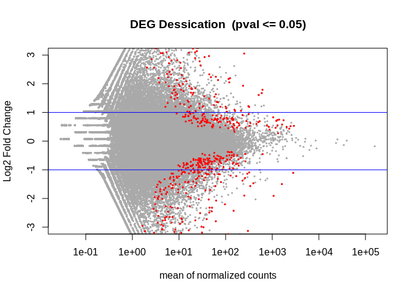

02-DGE-analysis
================
Kathleen Durkin
2025-04-08

- <a href="#1-downloading-reference" id="toc-1-downloading-reference">1
  Downloading reference</a>
- <a href="#2-downloading-sequence-reads"
  id="toc-2-downloading-sequence-reads">2 Downloading sequence reads</a>
- <a href="#3-running-deseq2" id="toc-3-running-deseq2">3 Running
  DESeq2</a>

Completing `Week 02` assignment of `FISH 546`, performing differential
gene analysis.

[Full assignment
details](https://sr320.github.io/course-fish546-2025/assignments/02-DGE.html)

# 1 Downloading reference

This code grabs the Pacific oyster fasta file of genes and does so
*ignoring* the fact that gannet does not have a security certificate to
authenticate (–insecure). This is usually not recommended however we
know the server.

``` bash
mkdir ../data/02-DGE-analysis
cd ../data/02-DGE-analysis

curl --insecure -O https://gannet.fish.washington.edu/seashell/bu-github/nb-2023/Cgigas/data/rna.fna
```

This code is indexing the file rna.fna while also renaming it as
cgigas_roslin_rna.index.

``` bash
/home/shared/kallisto/kallisto \
index -i \
../data/02-DGE-analysis/cgigas_roslin_rna.index \
../data/02-DGE-analysis/rna.fna
```

# 2 Downloading sequence reads

Sequence reads are on a public server at
<https://gannet.fish.washington.edu/seashell/bu-github/nb-2023/Cgigas/data/nopp/>

This code uses recursive feature of wget (see this weeks’ reading) to
get all 24 files. Additionally, as with curl above we are ignoring the
fact there is not security certificate with –no-check-certificate

``` bash
cd ../data/02-DGE-analysis

wget --recursive --no-parent --no-directories \
--no-check-certificate \
--accept '*.fastq.gz' \
https://gannet.fish.washington.edu/seashell/bu-github/nb-2023/Cgigas/data/nopp/
```

The next chunk first creates a subdirectory

Then performs the following steps:

Uses the find utility to search for all files in the ../data/ directory
that match the pattern \*fastq.gz.

Uses the basename command to extract the base filename of each file
(i.e., the filename without the directory path), and removes the suffix
\_L001_R1_001.fastq.gz.

Runs the kallisto quant command on each input file, with the following
options:

-i ../data/cgigas_roslin_rna.index: Use the kallisto index file located
at ../data/cgigas_roslin_rna.index.

-o ../output/02-DGE-analysis/{}: Write the output files to a directory
called ../output/02-DGE-analysis/ with a subdirectory named after the
base filename of the input file (the {} is a placeholder for the base
filename).

-t 40: Use 40 threads for the computation.

–single -l 100 -s 10: Specify that the input file contains single-end
reads (–single), with an average read length of 100 (-l 100) and a
standard deviation of 10 (-s 10). The input file to process is specified
using the {} placeholder, which is replaced by the base filename from
the previous step.

``` bash

find ../data/02-DGE-analysis/*fastq.gz \
| xargs basename -s _L001_R1_001.fastq.gz | xargs -I{} /home/shared/kallisto/kallisto \
quant -i ../data/02-DGE-analysis/cgigas_roslin_rna.index \
-o ../output/02-DGE-analysis/{} \
-t 40 \
--single -l 100 -s 10 ../data/02-DGE-analysis/{}_L001_R1_001.fastq.gz
```

This command runs the abundance_estimates_to_matrix.pl script from the
Trinity RNA-seq assembly software package to create a gene expression
matrix from kallisto output files.

The specific options and arguments used in the command are as follows:

perl
/home/shared/trinityrnaseq-v2.12.0/util/abundance_estimates_to_matrix.pl:
Run the abundance_estimates_to_matrix.pl script from Trinity.

–est_method kallisto: Specify that the abundance estimates were
generated using kallisto.

–gene_trans_map none: Do not use a gene-to-transcript mapping file.

–out_prefix ../output/02-DGE-analysis: Use ../output/02-DGE-analysis as
the output directory and prefix for the gene expression matrix file.

–name_sample_by_basedir: Use the sample directory name (i.e., the final
directory in the input file paths) as the sample name in the output
matrix.

And then there are the kallisto abundance files to use as input for
creating the gene expression matrix.

``` bash
perl /home/shared/trinityrnaseq-v2.12.0/util/abundance_estimates_to_matrix.pl \
--est_method kallisto \
    --gene_trans_map none \
    --out_prefix ../output/02-DGE-analysis \
    --name_sample_by_basedir \
    ../output/02-DGE-analysis/D54_S145/abundance.tsv \
    ../output/02-DGE-analysis/D56_S136/abundance.tsv \
    ../output/02-DGE-analysis/D58_S144/abundance.tsv \
    ../output/02-DGE-analysis/M45_S140/abundance.tsv \
    ../output/02-DGE-analysis/M48_S137/abundance.tsv \
    ../output/02-DGE-analysis/M89_S138/abundance.tsv \
    ../output/02-DGE-analysis/D55_S146/abundance.tsv \
    ../output/02-DGE-analysis/D57_S143/abundance.tsv \
    ../output/02-DGE-analysis/D59_S142/abundance.tsv \
    ../output/02-DGE-analysis/M46_S141/abundance.tsv \
    ../output/02-DGE-analysis/M49_S139/abundance.tsv \
    ../output/02-DGE-analysis/M90_S147/abundance.tsv \
    ../output/02-DGE-analysis/N48_S194/abundance.tsv \
    ../output/02-DGE-analysis/N50_S187/abundance.tsv \
    ../output/02-DGE-analysis/N52_S184/abundance.tsv \
    ../output/02-DGE-analysis/N54_S193/abundance.tsv \
    ../output/02-DGE-analysis/N56_S192/abundance.tsv \
    ../output/02-DGE-analysis/N58_S195/abundance.tsv \
    ../output/02-DGE-analysis/N49_S185/abundance.tsv \
    ../output/02-DGE-analysis/N51_S186/abundance.tsv \
    ../output/02-DGE-analysis/N53_S188/abundance.tsv \
    ../output/02-DGE-analysis/N55_S190/abundance.tsv \
    ../output/02-DGE-analysis/N57_S191/abundance.tsv \
    ../output/02-DGE-analysis/N59_S189/abundance.tsv
    
mv ../output/02-DGE-analysis.isoform* ../output/02-DGE-analysis/
```

# 3 Running DESeq2

This code performs differential expression analysis to identify
differentially expressed genes (DEGs) between a control condition and a
desiccated condition.

First, it reads in a count matrix of isoform counts generated by
Kallisto, with row names set to the gene/transcript IDs and the first
column removed. It then rounds the counts to whole numbers.

Next, it creates a data.frame containing information about the
experimental conditions and sets row names to match the column names in
the count matrix. It uses this information to create a DESeqDataSet
object, which is then passed to the DESeq() function to fit a negative
binomial model and estimate dispersions. The results() function is used
to extract the results table, which is ordered by gene/transcript ID.

The code then prints the top few rows of the results table and
calculates the number of DEGs with an adjusted p-value less than or
equal to 0.05. It plots the log2 fold changes versus the mean normalized
counts for all genes, highlighting significant DEGs in red and adding
horizontal lines at 2-fold upregulation and downregulation. Finally, it
writes the list of significant DEGs to a file called “DEGlist.tab”.

Note The below code could be a single script (or single chunk). I like
separating to assist in troubleshooting and check output at various
steps.

Load packages:

``` r
library(DESeq2)
```

    ## Loading required package: S4Vectors

    ## Loading required package: stats4

    ## Loading required package: BiocGenerics

    ## 
    ## Attaching package: 'BiocGenerics'

    ## The following objects are masked from 'package:stats':
    ## 
    ##     IQR, mad, sd, var, xtabs

    ## The following objects are masked from 'package:base':
    ## 
    ##     anyDuplicated, aperm, append, as.data.frame, basename, cbind,
    ##     colnames, dirname, do.call, duplicated, eval, evalq, Filter, Find,
    ##     get, grep, grepl, intersect, is.unsorted, lapply, Map, mapply,
    ##     match, mget, order, paste, pmax, pmax.int, pmin, pmin.int,
    ##     Position, rank, rbind, Reduce, rownames, sapply, setdiff, sort,
    ##     table, tapply, union, unique, unsplit, which.max, which.min

    ## 
    ## Attaching package: 'S4Vectors'

    ## The following objects are masked from 'package:base':
    ## 
    ##     expand.grid, I, unname

    ## Loading required package: IRanges

    ## Loading required package: GenomicRanges

    ## Loading required package: GenomeInfoDb

    ## Loading required package: SummarizedExperiment

    ## Loading required package: MatrixGenerics

    ## Loading required package: matrixStats

    ## 
    ## Attaching package: 'MatrixGenerics'

    ## The following objects are masked from 'package:matrixStats':
    ## 
    ##     colAlls, colAnyNAs, colAnys, colAvgsPerRowSet, colCollapse,
    ##     colCounts, colCummaxs, colCummins, colCumprods, colCumsums,
    ##     colDiffs, colIQRDiffs, colIQRs, colLogSumExps, colMadDiffs,
    ##     colMads, colMaxs, colMeans2, colMedians, colMins, colOrderStats,
    ##     colProds, colQuantiles, colRanges, colRanks, colSdDiffs, colSds,
    ##     colSums2, colTabulates, colVarDiffs, colVars, colWeightedMads,
    ##     colWeightedMeans, colWeightedMedians, colWeightedSds,
    ##     colWeightedVars, rowAlls, rowAnyNAs, rowAnys, rowAvgsPerColSet,
    ##     rowCollapse, rowCounts, rowCummaxs, rowCummins, rowCumprods,
    ##     rowCumsums, rowDiffs, rowIQRDiffs, rowIQRs, rowLogSumExps,
    ##     rowMadDiffs, rowMads, rowMaxs, rowMeans2, rowMedians, rowMins,
    ##     rowOrderStats, rowProds, rowQuantiles, rowRanges, rowRanks,
    ##     rowSdDiffs, rowSds, rowSums2, rowTabulates, rowVarDiffs, rowVars,
    ##     rowWeightedMads, rowWeightedMeans, rowWeightedMedians,
    ##     rowWeightedSds, rowWeightedVars

    ## Loading required package: Biobase

    ## Welcome to Bioconductor
    ## 
    ##     Vignettes contain introductory material; view with
    ##     'browseVignettes()'. To cite Bioconductor, see
    ##     'citation("Biobase")', and for packages 'citation("pkgname")'.

    ## 
    ## Attaching package: 'Biobase'

    ## The following object is masked from 'package:MatrixGenerics':
    ## 
    ##     rowMedians

    ## The following objects are masked from 'package:matrixStats':
    ## 
    ##     anyMissing, rowMedians

``` r
library(tidyverse)
```

    ## ── Attaching core tidyverse packages ──────────────────────── tidyverse 2.0.0 ──
    ## ✔ dplyr     1.1.4     ✔ readr     2.1.5
    ## ✔ forcats   1.0.0     ✔ stringr   1.5.1
    ## ✔ ggplot2   3.5.1     ✔ tibble    3.2.1
    ## ✔ lubridate 1.9.4     ✔ tidyr     1.3.1
    ## ✔ purrr     1.0.2

    ## ── Conflicts ────────────────────────────────────────── tidyverse_conflicts() ──
    ## ✖ lubridate::%within%() masks IRanges::%within%()
    ## ✖ dplyr::collapse()     masks IRanges::collapse()
    ## ✖ dplyr::combine()      masks Biobase::combine(), BiocGenerics::combine()
    ## ✖ dplyr::count()        masks matrixStats::count()
    ## ✖ dplyr::desc()         masks IRanges::desc()
    ## ✖ tidyr::expand()       masks S4Vectors::expand()
    ## ✖ dplyr::filter()       masks stats::filter()
    ## ✖ dplyr::first()        masks S4Vectors::first()
    ## ✖ dplyr::lag()          masks stats::lag()
    ## ✖ ggplot2::Position()   masks BiocGenerics::Position(), base::Position()
    ## ✖ purrr::reduce()       masks GenomicRanges::reduce(), IRanges::reduce()
    ## ✖ dplyr::rename()       masks S4Vectors::rename()
    ## ✖ lubridate::second()   masks S4Vectors::second()
    ## ✖ lubridate::second<-() masks S4Vectors::second<-()
    ## ✖ dplyr::slice()        masks IRanges::slice()
    ## ℹ Use the conflicted package (<http://conflicted.r-lib.org/>) to force all conflicts to become errors

``` r
library(pheatmap)
library(RColorBrewer)
library(data.table)
```

    ## 
    ## Attaching package: 'data.table'
    ## 
    ## The following objects are masked from 'package:lubridate':
    ## 
    ##     hour, isoweek, mday, minute, month, quarter, second, wday, week,
    ##     yday, year
    ## 
    ## The following objects are masked from 'package:dplyr':
    ## 
    ##     between, first, last
    ## 
    ## The following object is masked from 'package:purrr':
    ## 
    ##     transpose
    ## 
    ## The following object is masked from 'package:SummarizedExperiment':
    ## 
    ##     shift
    ## 
    ## The following object is masked from 'package:GenomicRanges':
    ## 
    ##     shift
    ## 
    ## The following object is masked from 'package:IRanges':
    ## 
    ##     shift
    ## 
    ## The following objects are masked from 'package:S4Vectors':
    ## 
    ##     first, second

Might need to install first eg

``` r
if (!require("BiocManager", quietly = TRUE))
    install.packages("BiocManager")

BiocManager::install("DESeq2")
```

Read in count matrix

``` r
countmatrix <- read.delim("../output/02-DGE-analysis/02-DGE-analysis.isoform.counts.matrix", header = TRUE, sep = '\t')
rownames(countmatrix) <- countmatrix$X
countmatrix <- countmatrix[,-1]
head(countmatrix)
```

    ##                D54_S145 D56_S136 D58_S144  M45_S140 M48_S137 M89_S138  D55_S146
    ## XM_011449836.3  625.997  590.654  437.854 814.34600  551.397   529.09 497.03800
    ## XM_011422388.3    0.000    1.000    0.000   1.00000    2.000     1.00   0.00000
    ## XM_034446549.1    0.000    0.000    0.000   1.51743    0.000     0.00   1.51929
    ## XR_004596422.1    0.000    0.000    0.000   0.00000    0.000     0.00   3.00000
    ## XM_011441947.3    2.000    0.000    0.000   0.00000    0.000     0.00   0.00000
    ## XM_020063082.2    0.000    0.000    0.000   1.00000    1.000     1.00   0.00000
    ##                D57_S143 D59_S142 M46_S141 M49_S139  M90_S147 N48_S194 N50_S187
    ## XM_011449836.3  808.653  597.057  820.993  849.273 694.19900  698.061  1046.56
    ## XM_011422388.3    0.000    1.000    2.000    0.000   0.00000    2.000     5.00
    ## XM_034446549.1    0.000    0.000    0.000    0.000   0.00000    0.000     0.00
    ## XR_004596422.1    0.000    1.000    0.000    0.000   0.00000    0.000     0.00
    ## XM_011441947.3    1.000    5.000    3.000    0.000   1.51259    0.000     1.00
    ## XM_020063082.2    0.000    0.000    0.000    0.000   0.00000    0.000     0.00
    ##                N52_S184 N54_S193 N56_S192 N58_S195 N49_S185 N51_S186 N53_S188
    ## XM_011449836.3  725.657  695.765       42  912.862  742.214  953.086  867.709
    ## XM_011422388.3    2.000    0.000        0    1.000    1.000    0.000    1.000
    ## XM_034446549.1    0.000    0.000        0    0.000    0.000    0.000    0.000
    ## XR_004596422.1    0.000    0.000        0    0.000    0.000    0.000    0.000
    ## XM_011441947.3    1.000    0.000        0    0.000    1.000    2.000    1.000
    ## XM_020063082.2    0.000    0.000        0    0.000    0.000    0.000    1.000
    ##                N55_S190 N57_S191 N59_S189
    ## XM_011449836.3   767.64  425.765  968.868
    ## XM_011422388.3     0.00    0.000    1.000
    ## XM_034446549.1     0.00    0.000    0.000
    ## XR_004596422.1     1.00    0.000    0.000
    ## XM_011441947.3     0.00    0.000    0.000
    ## XM_020063082.2     2.00    2.000    0.000

Round integers up to whole numbers for further analysis:

``` r
countmatrix <- round(countmatrix, 0)
str(countmatrix)
```

    ## 'data.frame':    73307 obs. of  24 variables:
    ##  $ D54_S145: num  626 0 0 0 2 0 0 0 0 18 ...
    ##  $ D56_S136: num  591 1 0 0 0 0 0 0 0 52 ...
    ##  $ D58_S144: num  438 0 0 0 0 0 5 0 0 115 ...
    ##  $ M45_S140: num  814 1 2 0 0 1 0 0 0 40 ...
    ##  $ M48_S137: num  551 2 0 0 0 1 0 0 0 39 ...
    ##  $ M89_S138: num  529 1 0 0 0 1 3 0 0 121 ...
    ##  $ D55_S146: num  497 0 2 3 0 0 10 0 0 75 ...
    ##  $ D57_S143: num  809 0 0 0 1 0 0 0 0 20 ...
    ##  $ D59_S142: num  597 1 0 1 5 0 0 0 0 49 ...
    ##  $ M46_S141: num  821 2 0 0 3 0 0 0 0 36 ...
    ##  $ M49_S139: num  849 0 0 0 0 0 0 0 0 35 ...
    ##  $ M90_S147: num  694 0 0 0 2 0 0 0 0 12 ...
    ##  $ N48_S194: num  698 2 0 0 0 0 0 0 0 67 ...
    ##  $ N50_S187: num  1047 5 0 0 1 ...
    ##  $ N52_S184: num  726 2 0 0 1 0 0 0 0 209 ...
    ##  $ N54_S193: num  696 0 0 0 0 0 0 0 0 37 ...
    ##  $ N56_S192: num  42 0 0 0 0 0 0 1 0 5 ...
    ##  $ N58_S195: num  913 1 0 0 0 0 0 0 0 13 ...
    ##  $ N49_S185: num  742 1 0 0 1 0 6 0 0 73 ...
    ##  $ N51_S186: num  953 0 0 0 2 0 0 0 0 8 ...
    ##  $ N53_S188: num  868 1 0 0 1 1 0 0 0 32 ...
    ##  $ N55_S190: num  768 0 0 1 0 2 0 0 0 13 ...
    ##  $ N57_S191: num  426 0 0 0 0 2 0 0 0 95 ...
    ##  $ N59_S189: num  969 1 0 0 0 0 0 51 0 34 ...

Get DEGs based on Desication

``` r
deseq2.colData <- data.frame(condition=factor(c(rep("control", 12), rep("desicated", 12))), 
                             type=factor(rep("single-read", 24)))
rownames(deseq2.colData) <- colnames(data)
deseq2.dds <- DESeqDataSetFromMatrix(countData = countmatrix,
                                     colData = deseq2.colData, 
                                     design = ~ condition)
```

    ## converting counts to integer mode

``` r
deseq2.dds <- DESeq(deseq2.dds)
```

    ## estimating size factors

    ## estimating dispersions

    ## gene-wise dispersion estimates

    ## mean-dispersion relationship

    ## final dispersion estimates

    ## fitting model and testing

    ## -- replacing outliers and refitting for 5677 genes
    ## -- DESeq argument 'minReplicatesForReplace' = 7 
    ## -- original counts are preserved in counts(dds)

    ## estimating dispersions

    ## fitting model and testing

``` r
deseq2.res <- results(deseq2.dds)
deseq2.res <- deseq2.res[order(rownames(deseq2.res)), ]
```

``` r
head(deseq2.res)
```

    ## log2 fold change (MLE): condition desicated vs control 
    ## Wald test p-value: condition desicated vs control 
    ## DataFrame with 6 rows and 6 columns
    ##                  baseMean log2FoldChange     lfcSE      stat      pvalue
    ##                 <numeric>      <numeric> <numeric> <numeric>   <numeric>
    ## NM_001305288.1   0.181270      1.0453698  3.002647  0.348149 7.27728e-01
    ## NM_001305289.1   0.881457     -2.8119577  1.068276 -2.632239 8.48240e-03
    ## NM_001305290.1 145.913728      0.4580323  0.116185  3.942251 8.07203e-05
    ## NM_001305291.1   0.261701      0.5618449  1.587076  0.354013 7.23329e-01
    ## NM_001305292.1   2.902430     -1.2181330  0.763421 -1.595624 1.10573e-01
    ## NM_001305293.1 234.342117      0.0663449  0.131969  0.502731 6.15154e-01
    ##                      padj
    ##                 <numeric>
    ## NM_001305288.1         NA
    ## NM_001305289.1         NA
    ## NM_001305290.1 0.00956401
    ## NM_001305291.1         NA
    ## NM_001305292.1 0.59541971
    ## NM_001305293.1 0.95562321

``` r
# Count number of hits with adjusted p-value less then 0.05
dim(deseq2.res[!is.na(deseq2.res$padj) & deseq2.res$padj <= 0.05, ])
```

    ## [1] 607   6

``` r
tmp <- deseq2.res
# The main plot
plot(tmp$baseMean, tmp$log2FoldChange, pch=20, cex=0.45, ylim=c(-3, 3), log="x", col="darkgray",
     main="DEG Dessication  (pval <= 0.05)",
     xlab="mean of normalized counts",
     ylab="Log2 Fold Change")
```

    ## Warning in xy.coords(x, y, xlabel, ylabel, log): 16484 x values <= 0 omitted
    ## from logarithmic plot

``` r
# Getting the significant points and plotting them again so they're a different color
tmp.sig <- deseq2.res[!is.na(deseq2.res$padj) & deseq2.res$padj <= 0.05, ]
points(tmp.sig$baseMean, tmp.sig$log2FoldChange, pch=20, cex=0.45, col="red")
# 2 FC lines
abline(h=c(-1,1), col="blue")
```

<!-- -->

``` r
write.table(tmp.sig, "../output/02-DGE-analysis/DEGlist.tab", row.names = T)
```
