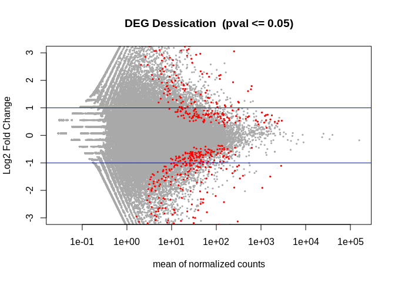

03-explain-and-knit
================
Kathleen Durkin
2025-04-15

- <a href="#1-load-packages" id="toc-1-load-packages">1 Load packages:</a>
- <a href="#2-blast" id="toc-2-blast">2 Blast</a>
  - <a href="#21-download-uniprotswissprot-reference-fastas"
    id="toc-21-download-uniprotswissprot-reference-fastas">2.1 Download
    Uniprot/Swissprot reference fastas</a>
  - <a href="#22-build-blast-db" id="toc-22-build-blast-db">2.2 Build BLAST
    db</a>
  - <a href="#23-downloading-reference"
    id="toc-23-downloading-reference">2.3 Downloading reference</a>
  - <a href="#24-run-blast" id="toc-24-run-blast">2.4 Run BLAST</a>
  - <a href="#25-download-uniprotswissprot-reference-table"
    id="toc-25-download-uniprotswissprot-reference-table">2.5 Download
    Uniprot/Swissprot reference table</a>
  - <a href="#26-join-tables-to-functionally-annotate-sequences"
    id="toc-26-join-tables-to-functionally-annotate-sequences">2.6 Join
    tables to functionally annotate sequences</a>
- <a href="#3-differential-gene-expression-analysis"
  id="toc-3-differential-gene-expression-analysis">3 Differential Gene
  Expression analysis</a>
  - <a href="#31-index-the-reference" id="toc-31-index-the-reference">3.1
    Index the reference</a>
  - <a href="#32-downloading-sequence-reads"
    id="toc-32-downloading-sequence-reads">3.2 Downloading sequence
    reads</a>
  - <a href="#33-running-deseq2" id="toc-33-running-deseq2">3.3 Running
    DESeq2</a>
  - <a href="#34-visualize-results" id="toc-34-visualize-results">3.4
    Visualize results</a>
    - <a href="#341-variance-stabilizing-transformations-vst"
      id="toc-341-variance-stabilizing-transformations-vst">3.4.1 Variance
      stabilizing transformations (VST)</a>
    - <a href="#342-sample-distances" id="toc-342-sample-distances">3.4.2
      Sample distances</a>
    - <a href="#343-pca" id="toc-343-pca">3.4.3 PCA</a>
    - <a href="#344-heatmap" id="toc-344-heatmap">3.4.4 Heatmap</a>
    - <a href="#345-volcano-plot" id="toc-345-volcano-plot">3.4.5 Volcano
      plot</a>
    - <a href="#346-functionally-annotate-degs"
      id="toc-346-functionally-annotate-degs">3.4.6 Functionally annotate
      DEGs</a>

Assignment details
[here](https://sr320.github.io/course-fish546-2025/assignments/03-knit.html)

Basically, I’ll be running blast and differential expression analysis
with more detailed explanation and output summary (including
visualizations)

# 1 Load packages:

``` r
library(dplyr)
```

    ## 
    ## Attaching package: 'dplyr'

    ## The following objects are masked from 'package:stats':
    ## 
    ##     filter, lag

    ## The following objects are masked from 'package:base':
    ## 
    ##     intersect, setdiff, setequal, union

``` r
library(DESeq2)
```

    ## Loading required package: S4Vectors

    ## Loading required package: stats4

    ## Loading required package: BiocGenerics

    ## 
    ## Attaching package: 'BiocGenerics'

    ## The following objects are masked from 'package:dplyr':
    ## 
    ##     combine, intersect, setdiff, union

    ## The following objects are masked from 'package:stats':
    ## 
    ##     IQR, mad, sd, var, xtabs

    ## The following objects are masked from 'package:base':
    ## 
    ##     anyDuplicated, aperm, append, as.data.frame, basename, cbind,
    ##     colnames, dirname, do.call, duplicated, eval, evalq, Filter, Find,
    ##     get, grep, grepl, intersect, is.unsorted, lapply, Map, mapply,
    ##     match, mget, order, paste, pmax, pmax.int, pmin, pmin.int,
    ##     Position, rank, rbind, Reduce, rownames, sapply, setdiff, sort,
    ##     table, tapply, union, unique, unsplit, which.max, which.min

    ## 
    ## Attaching package: 'S4Vectors'

    ## The following objects are masked from 'package:dplyr':
    ## 
    ##     first, rename

    ## The following objects are masked from 'package:base':
    ## 
    ##     expand.grid, I, unname

    ## Loading required package: IRanges

    ## 
    ## Attaching package: 'IRanges'

    ## The following objects are masked from 'package:dplyr':
    ## 
    ##     collapse, desc, slice

    ## Loading required package: GenomicRanges

    ## Loading required package: GenomeInfoDb

    ## Loading required package: SummarizedExperiment

    ## Loading required package: MatrixGenerics

    ## Loading required package: matrixStats

    ## 
    ## Attaching package: 'matrixStats'

    ## The following object is masked from 'package:dplyr':
    ## 
    ##     count

    ## 
    ## Attaching package: 'MatrixGenerics'

    ## The following objects are masked from 'package:matrixStats':
    ## 
    ##     colAlls, colAnyNAs, colAnys, colAvgsPerRowSet, colCollapse,
    ##     colCounts, colCummaxs, colCummins, colCumprods, colCumsums,
    ##     colDiffs, colIQRDiffs, colIQRs, colLogSumExps, colMadDiffs,
    ##     colMads, colMaxs, colMeans2, colMedians, colMins, colOrderStats,
    ##     colProds, colQuantiles, colRanges, colRanks, colSdDiffs, colSds,
    ##     colSums2, colTabulates, colVarDiffs, colVars, colWeightedMads,
    ##     colWeightedMeans, colWeightedMedians, colWeightedSds,
    ##     colWeightedVars, rowAlls, rowAnyNAs, rowAnys, rowAvgsPerColSet,
    ##     rowCollapse, rowCounts, rowCummaxs, rowCummins, rowCumprods,
    ##     rowCumsums, rowDiffs, rowIQRDiffs, rowIQRs, rowLogSumExps,
    ##     rowMadDiffs, rowMads, rowMaxs, rowMeans2, rowMedians, rowMins,
    ##     rowOrderStats, rowProds, rowQuantiles, rowRanges, rowRanks,
    ##     rowSdDiffs, rowSds, rowSums2, rowTabulates, rowVarDiffs, rowVars,
    ##     rowWeightedMads, rowWeightedMeans, rowWeightedMedians,
    ##     rowWeightedSds, rowWeightedVars

    ## Loading required package: Biobase

    ## Welcome to Bioconductor
    ## 
    ##     Vignettes contain introductory material; view with
    ##     'browseVignettes()'. To cite Bioconductor, see
    ##     'citation("Biobase")', and for packages 'citation("pkgname")'.

    ## 
    ## Attaching package: 'Biobase'

    ## The following object is masked from 'package:MatrixGenerics':
    ## 
    ##     rowMedians

    ## The following objects are masked from 'package:matrixStats':
    ## 
    ##     anyMissing, rowMedians

``` r
library(tidyverse)
```

    ## ── Attaching core tidyverse packages ──────────────────────── tidyverse 2.0.0 ──
    ## ✔ forcats   1.0.0     ✔ readr     2.1.5
    ## ✔ ggplot2   3.5.1     ✔ stringr   1.5.1
    ## ✔ lubridate 1.9.4     ✔ tibble    3.2.1
    ## ✔ purrr     1.0.2     ✔ tidyr     1.3.1

    ## ── Conflicts ────────────────────────────────────────── tidyverse_conflicts() ──
    ## ✖ lubridate::%within%() masks IRanges::%within%()
    ## ✖ IRanges::collapse()   masks dplyr::collapse()
    ## ✖ Biobase::combine()    masks BiocGenerics::combine(), dplyr::combine()
    ## ✖ matrixStats::count()  masks dplyr::count()
    ## ✖ IRanges::desc()       masks dplyr::desc()
    ## ✖ tidyr::expand()       masks S4Vectors::expand()
    ## ✖ dplyr::filter()       masks stats::filter()
    ## ✖ S4Vectors::first()    masks dplyr::first()
    ## ✖ dplyr::lag()          masks stats::lag()
    ## ✖ ggplot2::Position()   masks BiocGenerics::Position(), base::Position()
    ## ✖ purrr::reduce()       masks GenomicRanges::reduce(), IRanges::reduce()
    ## ✖ S4Vectors::rename()   masks dplyr::rename()
    ## ✖ lubridate::second()   masks S4Vectors::second()
    ## ✖ lubridate::second<-() masks S4Vectors::second<-()
    ## ✖ IRanges::slice()      masks dplyr::slice()
    ## ℹ Use the conflicted package (<http://conflicted.r-lib.org/>) to force all conflicts to become errors

``` r
library(pheatmap)
library(RColorBrewer)
library(data.table)
```

    ## 
    ## Attaching package: 'data.table'
    ## 
    ## The following objects are masked from 'package:lubridate':
    ## 
    ##     hour, isoweek, mday, minute, month, quarter, second, wday, week,
    ##     yday, year
    ## 
    ## The following object is masked from 'package:purrr':
    ## 
    ##     transpose
    ## 
    ## The following object is masked from 'package:SummarizedExperiment':
    ## 
    ##     shift
    ## 
    ## The following object is masked from 'package:GenomicRanges':
    ## 
    ##     shift
    ## 
    ## The following object is masked from 'package:IRanges':
    ## 
    ##     shift
    ## 
    ## The following objects are masked from 'package:S4Vectors':
    ## 
    ##     first, second
    ## 
    ## The following objects are masked from 'package:dplyr':
    ## 
    ##     between, first, last

# 2 Blast

## 2.1 Download Uniprot/Swissprot reference fastas

Download fasta file of genes with known functions. Our reads will then
be mapped (aligned) to these fastas. If one of our reads maps to a gene
with known function in a different species, then it likely has similar
function in our species of interest.

see <https://www.uniprot.org/downloads>

<https://ftp.uniprot.org/pub/databases/uniprot/current_release/knowledgebase/complete/uniprot_sprot.fasta.gz>

``` bash
cd ../data
curl -O https://ftp.uniprot.org/pub/databases/uniprot/current_release/knowledgebase/complete/uniprot_sprot.fasta.gz
mv uniprot_sprot.fasta.gz uniprot_sprot_r2025_04_03.fasta.gz
gunzip -k uniprot_sprot_r2025_04_03.fasta.gz
ls ../data
```

## 2.2 Build BLAST db

This is essentially a database of Uniprot-sourced fastas (genes of known
function)

``` bash
# If working in Jupytr Hub, file path is:
# /home/jovyan/applications/ncbi-blast-2.16.0+/bin

/home/shared/ncbi-blast-2.15.0+/bin/makeblastdb \
-in ../data/uniprot_sprot_r2025_04_03.fasta \
-dbtype prot \
-out ../output/03-explain-and-knit/blastdb/uniprot_sprot_r2025_04_03
```

## 2.3 Downloading reference

We’ll eventually be performing alignment using kallisto
pseudo-allignment, which requires a reference \*transcriptome8.

Download *C.gigas* transcriptome.

Note I already have the transcriptome downloaded to
`kathleen-coral/assignments/data/02-DGE-analysis/`, so I will be
accessing it from that location throuhout this code. You may need to
change some file paths if you prefer to store the transcriptome from a
different location.

``` bash
mkdir ../data/02-DGE-analysis
cd ../data/02-DGE-analysis

curl --insecure -O https://gannet.fish.washington.edu/seashell/bu-github/nb-2023/Cgigas/data/rna.fna
```

Check the genome.

``` bash
head ../data/02-DGE-analysis/rna.fna

echo""
echo "How many sequences are there?"

grep -c ">" ../data/02-DGE-analysis/rna.fna
```

    ## >NM_001305288.1 Crassostrea gigas uncharacterized LOC105326593 (LOC105326593), mRNA
    ## AATGATTTTAAGTTAACAGGACTGCCACATTGGCTAGGAAAATGAAGGTCGTTCCATCTTTGTTTATTTTCATAATCTGT
    ## GTATTCATTTCATCGGGACAACGCCCTGACCCTTTTCCGAAAGGTTGCAAAGCGCAGATTGACGTCGTTTTTGTAATCGA
    ## TGGATCAGACAGTATCTCTGAGTCAGATTTCCAAACCCTTCGTACGTCCATTTCCAGAATAGTTGACGGCTTTCATATTG
    ## GCTCTGGAGAAACCAGGATGGGCATCATCGTGTACAGTAAAGGTGTTGCCTTCTCTGTCCCGCTCTCATACGATCCGGTG
    ## TATCTAAAAGATCAAGCCAGCATCATGCCTCATCCTAGAGAGGGTACCAACACCCACCTTGGTATAGAGGAGATGATAGA
    ## TATGTTTAAAAAAGACAAACGAGATGGGGTTCCTATGGCTGGTGTTGTGGTCACTGATGGAATATCTAAAGAAAAGGAAA
    ## AAACCCTACTACAGTCAAGATTAGCGAGAGATTTGGGTATTAACATGTTCTCGGTGGGCGTCGGTCGTTACACGGAGGAA
    ## GAGGAACTAAGAGGAATCGCTTCGAATCCTGATCAGGCTATCAAAGTGGAGTCCTTTGACGAACTGCTGAAAATTTTATC
    ## AAAACTTGTGCAGTTAGTTTGTCCAAACAAATGTATGATGCCTGGTGTCATTGCCTACCCAAACGACGTATCGAAAAACT
    ## 
    ## How many sequences are there?
    ## 73307

## 2.4 Run BLAST

This will map genes of known function to our genome.

``` bash
/home/shared/ncbi-blast-2.15.0+/bin/blastx \
-query ../data/02-DGE-analysis/rna.fna \
-db ../output/03-explain-and-knit/blastdb/uniprot_sprot_r2025_04_03 \
-out ../output/03-explain-and-knit/Cgigas-uniprot_blastx.tab \
-evalue 1E-20 \
-num_threads 20 \
-max_target_seqs 1 \
-outfmt 6
```

Check blast output

``` bash
head -2 ../output/03-explain-and-knit/Cgigas-uniprot_blastx.tab

echo ""
echo "How many sequences in our transcriptome mapped to sequences of known function?"
wc -l ../output/03-explain-and-knit/Cgigas-uniprot_blastx.tab
```

    ## NM_001305289.1   sp|O02768|PGH2_RABIT    57.092  557 235 4   466 2127    15  570 0.0 689
    ## NM_001305290.1   sp|Q5ZLR5|UCRI_CHICK    51.777  197 94  1   227 817 75  270 2.99e-68    217
    ## 
    ## How many sequences in our transcriptome mapped to sequences of known function?
    ## 8494 ../output/03-explain-and-knit/Cgigas-uniprot_blastx.tab

## 2.5 Download Uniprot/Swissprot reference table

This table provides detailed functional information for each of the
previously described sequences.

Download

``` bash
cd ../data
curl -o uniprot_table_r2025_04_03.tab -H "Accept: text/plain; format=tsv" "https://rest.uniprot.org/uniprotkb/stream?compressed=true&fields=accession%2Creviewed%2Cid%2Cprotein_name%2Cgene_names%2Corganism_name%2Clength%2Cgo_p%2Cgo%2Cgo_id%2Cgo_c%2Cgo_f&format=tsv&query=%28*%29+AND+%28reviewed%3Atrue%29"

mv "stream?compressed=true&fields=accession%2Creviewed%2Cid%2Cprotein_name%2Cgene_names%2Corganism_name%2Clength%2Cgo_p%2Cgo%2Cgo_id%2Cgo_c%2Cgo_f&format=tsv&query=%28*%29+AND+%28reviewed%3Atrue%29" uniprot_table_r2025_04_03.tab
```

Check file

``` bash
head -2 ../data/uniprot_table_r2025_04_03.tab
wc -l ../data/uniprot_table_r2025_04_03.tab
```

    ## <8b>
    ## <ab><96><86>k<9c>4o<ed>2<df>x<eb><de><e1><ef>8<b3>^<f3><f3>g%G<fe><b3>.<9f><e7>e<ea>%/<d3>W<f3>2<8d>U<fb><d1> BhnZ]<af><c3>$<9a>wn.بٽ<ee>j<f3><cd>8\<ea><d1>r<92>4<d9><ab>y<ad>C@<f6>)<.<fa>e<80><a5><a5><d7>SjC<af>$<b3><97>V
    ## 248932 ../data/uniprot_table_r2025_04_03.tab

We have functional information for 248,932 entries.

## 2.6 Join tables to functionally annotate sequences

We now have two tables. One matches genes of known function to our
genome. The other matches functional information to genes of known
function. We want to match functional information to our genome.

First, the Blast output includes matching information in the format
`sp|O42248|GBLP_DANRE`. We will need to use the Accession ID, which is
the middle alphanumeric.

Separate the `sp|O42248|GBLP_DANRE` portion into its individual
components (so they can be used for searching/joining purposes).

``` bash
tr '|' '\t' < ../output/03-explain-and-knit/Cgigas-uniprot_blastx.tab | head -2
```

    ## NM_001305289.1   sp  O02768  PGH2_RABIT  57.092  557 235 4   466 2127    15  570 0.0 689
    ## NM_001305290.1   sp  Q5ZLR5  UCRI_CHICK  51.777  197 94  1   227 817 75  270 2.99e-68    217

Save this as a new file.

``` bash
tr '|' '\t' < ../output/03-explain-and-knit/Cgigas-uniprot_blastx.tab \
> ../output/03-explain-and-knit/Cgigas-uniprot_blastx_sep.tab
```

Read blast results and Uniprot/Swissprot table into R and join.

``` r
library(tidyverse)
library(kableExtra)
```

    ## 
    ## Attaching package: 'kableExtra'

    ## The following object is masked from 'package:dplyr':
    ## 
    ##     group_rows

``` r
# Load data
bltabl <- read.csv("../output/03-explain-and-knit/Cgigas-uniprot_blastx_sep.tab", sep = '\t', header = FALSE)
spgo <- read.csv("../data/uniprot_table_r2025_04_03.tab", sep = '\t', header = TRUE)

annotated <- left_join(bltabl, spgo,  by = c("V3" = "Entry")) %>%
    # Select columns of interest
  select(V1, V3, V13, Protein.names, Organism, Gene.Ontology..biological.process., Gene.Ontology.IDs)

# Use kable formatting for a more legible output
kbl(head(annotated)) %>% kable_styling(bootstrap_options = c("striped", "hover", "condensed", "responsive"))
```

<table class="table table-striped table-hover table-condensed table-responsive" style="margin-left: auto; margin-right: auto;">
<thead>
<tr>
<th style="text-align:left;">

V1

</th>
<th style="text-align:left;">

V3

</th>
<th style="text-align:right;">

V13

</th>
<th style="text-align:left;">

Protein.names

</th>
<th style="text-align:left;">

Organism

</th>
<th style="text-align:left;">

Gene.Ontology..biological.process.

</th>
<th style="text-align:left;">

Gene.Ontology.IDs

</th>
</tr>
</thead>
<tbody>
<tr>
<td style="text-align:left;">

NM_001305289.1

</td>
<td style="text-align:left;">

O02768

</td>
<td style="text-align:right;">

0

</td>
<td style="text-align:left;">

Prostaglandin G/H synthase 2 (EC 1.14.99.1) (Cyclooxygenase-2) (COX-2)
(PHS II) (Prostaglandin H2 synthase 2) (PGH synthase 2) (PGHS-2)
(Prostaglandin-endoperoxide synthase 2)

</td>
<td style="text-align:left;">

Oryctolagus cuniculus (Rabbit)

</td>
<td style="text-align:left;">

brown fat cell differentiation $$GO:0050873$$; cellular response to
fluid shear stress $$GO:0071498$$; cellular response to hypoxia
$$GO:0071456$$; cellular response to non-ionic osmotic stress
$$GO:0071471$$; cyclooxygenase pathway $$GO:0019371$$; decidualization
$$GO:0046697$$; embryo implantation $$GO:0007566$$; negative regulation
of intrinsic apoptotic signaling pathway in response to osmotic stress
$$GO:1902219$$; positive regulation of brown fat cell differentiation
$$GO:0090336$$; positive regulation of fever generation $$GO:0031622$$;
positive regulation of prostaglandin biosynthetic process
$$GO:0031394$$; prostaglandin biosynthetic process $$GO:0001516$$;
prostaglandin secretion $$GO:0032310$$; regulation of blood pressure
$$GO:0008217$$; regulation of cell population proliferation
$$GO:0042127$$; regulation of neuroinflammatory response $$GO:0150077$$;
response to nematode $$GO:0009624$$; response to oxidative stress
$$GO:0006979$$; response to selenium ion $$GO:0010269$$

</td>
<td style="text-align:left;">

<GO:0001516>; <GO:0004601>; <GO:0004666>; <GO:0005637>; <GO:0005640>;
<GO:0005737>; <GO:0005789>; <GO:0006979>; <GO:0007566>; <GO:0008217>;
<GO:0009624>; <GO:0010269>; <GO:0016702>; <GO:0019371>; <GO:0019899>;
<GO:0020037>; <GO:0031394>; <GO:0031622>; <GO:0032310>; <GO:0042127>;
<GO:0042803>; <GO:0043005>; <GO:0046697>; <GO:0046872>; <GO:0050873>;
<GO:0071456>; <GO:0071471>; <GO:0071498>; <GO:0090336>; <GO:0150077>;
<GO:1902219>

</td>
</tr>
<tr>
<td style="text-align:left;">

NM_001305290.1

</td>
<td style="text-align:left;">

Q5ZLR5

</td>
<td style="text-align:right;">

0

</td>
<td style="text-align:left;">

Cytochrome b-c1 complex subunit Rieske, mitochondrial (EC 7.1.1.8)
(Complex III subunit 5) (Cytochrome b-c1 complex subunit 5) (Rieske
iron-sulfur protein) (RISP) (Rieske protein UQCRFS1)
(Ubiquinol-cytochrome c reductase iron-sulfur subunit) $$Cleaved into:
Cytochrome b-c1 complex subunit 9 (Su9) (Subunit 9) (Complex III subunit
IX) (UQCRFS1 mitochondrial targeting sequence) (UQCRFS1 MTS)$$

</td>
<td style="text-align:left;">

Gallus gallus (Chicken)

</td>
<td style="text-align:left;">

mitochondrial electron transport, ubiquinol to cytochrome c
$$GO:0006122$$

</td>
<td style="text-align:left;">

<GO:0005743>; <GO:0006122>; <GO:0008121>; <GO:0016491>; <GO:0045275>;
<GO:0046872>; <GO:0051537>

</td>
</tr>
<tr>
<td style="text-align:left;">

NM_001305292.1

</td>
<td style="text-align:left;">

H2A0L0

</td>
<td style="text-align:right;">

0

</td>
<td style="text-align:left;">

Tyrosinase-like protein 1 (EC 1.14.18.-) (Tyrosinase 1)

</td>
<td style="text-align:left;">

Margaritifera margaritifera (Freshwater pearl mussel)

</td>
<td style="text-align:left;">
</td>
<td style="text-align:left;">

<GO:0005576>; <GO:0016491>; <GO:0046872>

</td>
</tr>
<tr>
<td style="text-align:left;">

NM_001305293.1

</td>
<td style="text-align:left;">

P29190

</td>
<td style="text-align:right;">

0

</td>
<td style="text-align:left;">

Phosphoenolpyruvate carboxykinase $$GTP$$ (PEPCK) (EC 4.1.1.32)

</td>
<td style="text-align:left;">

Haemonchus contortus (Barber pole worm)

</td>
<td style="text-align:left;">

cellular response to glucose stimulus $$GO:0071333$$; gluconeogenesis
$$GO:0006094$$; glycerol biosynthetic process from pyruvate
$$GO:0046327$$; oxaloacetate metabolic process $$GO:0006107$$;
propionate catabolic process $$GO:0019543$$; response to lipid
$$GO:0033993$$; response to starvation $$GO:0042594$$

</td>
<td style="text-align:left;">

<GO:0004613>; <GO:0005525>; <GO:0005829>; <GO:0006094>; <GO:0006107>;
<GO:0019543>; <GO:0030145>; <GO:0033993>; <GO:0042594>; <GO:0046327>;
<GO:0071333>

</td>
</tr>
<tr>
<td style="text-align:left;">

NM_001305295.1

</td>
<td style="text-align:left;">

P35224

</td>
<td style="text-align:right;">

0

</td>
<td style="text-align:left;">

Catenin beta (Beta-catenin)

</td>
<td style="text-align:left;">

Urechis caupo (Innkeeper worm) (Spoonworm)

</td>
<td style="text-align:left;">

cell adhesion $$GO:0007155$$

</td>
<td style="text-align:left;">

<GO:0005737>; <GO:0005856>; <GO:0007155>; <GO:0045296>

</td>
</tr>
<tr>
<td style="text-align:left;">

NM_001305296.1

</td>
<td style="text-align:left;">

P81004

</td>
<td style="text-align:right;">

0

</td>
<td style="text-align:left;">

Non-selective voltage-gated ion channel VDAC2 (VDAC-2) (Outer
mitochondrial membrane protein porin)

</td>
<td style="text-align:left;">

Xenopus laevis (African clawed frog)

</td>
<td style="text-align:left;">

monoatomic anion transport $$GO:0006820$$

</td>
<td style="text-align:left;">

<GO:0000166>; <GO:0005244>; <GO:0005741>; <GO:0006820>; <GO:0008308>;
<GO:0015288>; <GO:0046930>

</td>
</tr>
</tbody>
</table>

``` r
write_delim(annotated, "../output/03-explain-and-knit/blast_annot_go.tab", delim = '\t')
```

# 3 Differential Gene Expression analysis

## 3.1 Index the reference

Index the C.gigas transcriptome file `rna.fna` while also renaming it as
cgigas_roslin_rna.index. Index will make downstream use of the file less
computationally intensive.

``` bash
/home/shared/kallisto/kallisto \
index -i \
../data/02-DGE-analysis/cgigas_roslin_rna.index \
../data/02-DGE-analysis/rna.fna
```

## 3.2 Downloading sequence reads

Sequence reads are on a public server at
<https://gannet.fish.washington.edu/seashell/bu-github/nb-2023/Cgigas/data/nopp/>

This code uses recursive feature of wget (see this weeks’ reading) to
get all 24 files. Additionally, as with curl above we are ignoring the
fact there is not security certificate with –no-check-certificate

Again, note I’ll be accessing the reads from the `02-DGE-analysis`
folder.

``` bash
cd ../data/02-DGE-analysis

wget --recursive --no-parent --no-directories \
--no-check-certificate \
--accept '*.fastq.gz' \
https://gannet.fish.washington.edu/seashell/bu-github/nb-2023/Cgigas/data/nopp/
```

The next chunk first creates a subdirectory

Then performs the following steps:

Uses the `find` utility to search for all files in the ../data/
directory that match the pattern \*fastq.gz.

Uses the basename command to extract the base filename of each file
(i.e., the filename without the directory path), and removes the suffix
\_L001_R1_001.fastq.gz.

Runs the kallisto quant command on each input file, with the following
options:

-i ../data/cgigas_roslin_rna.index: Use the kallisto index file located
at ../data/cgigas_roslin_rna.index.

-o ../output/02-DGE-analysis/{}: Write the output files to a directory
called ../output/02-DGE-analysis/ with a subdirectory named after the
base filename of the input file (the {} is a placeholder for the base
filename).

-t 40: Use 40 threads for the computation.

–single -l 100 -s 10: Specify that the input file contains single-end
reads (–single), with an average read length of 100 (-l 100) and a
standard deviation of 10 (-s 10). The input file to process is specified
using the {} placeholder, which is replaced by the base filename from
the previous step.

``` bash

find ../data/02-DGE-analysis/*fastq.gz \
| xargs basename -s _L001_R1_001.fastq.gz | xargs -I{} /home/shared/kallisto/kallisto \
quant -i ../data/02-DGE-analysis/cgigas_roslin_rna.index \
-o ../output/02-DGE-analysis/{} \
-t 40 \
--single -l 100 -s 10 ../data/02-DGE-analysis/{}_L001_R1_001.fastq.gz
```

This command runs the abundance_estimates_to_matrix.pl script from the
Trinity RNA-seq assembly software package to create a gene expression
matrix from kallisto output files.

The specific options and arguments used in the command are as follows:

perl
/home/shared/trinityrnaseq-v2.12.0/util/abundance_estimates_to_matrix.pl:
Run the abundance_estimates_to_matrix.pl script from Trinity.

–est_method kallisto: Specify that the abundance estimates were
generated using kallisto.

–gene_trans_map none: Do not use a gene-to-transcript mapping file.

–out_prefix ../output/02-DGE-analysis: Use ../output/02-DGE-analysis as
the output directory and prefix for the gene expression matrix file.

–name_sample_by_basedir: Use the sample directory name (i.e., the final
directory in the input file paths) as the sample name in the output
matrix.

And then there are the kallisto abundance files to use as input for
creating the gene expression matrix.

``` bash
perl /home/shared/trinityrnaseq-v2.12.0/util/abundance_estimates_to_matrix.pl \
--est_method kallisto \
    --gene_trans_map none \
    --out_prefix ../output/02-DGE-analysis \
    --name_sample_by_basedir \
    ../output/02-DGE-analysis/D54_S145/abundance.tsv \
    ../output/02-DGE-analysis/D56_S136/abundance.tsv \
    ../output/02-DGE-analysis/D58_S144/abundance.tsv \
    ../output/02-DGE-analysis/M45_S140/abundance.tsv \
    ../output/02-DGE-analysis/M48_S137/abundance.tsv \
    ../output/02-DGE-analysis/M89_S138/abundance.tsv \
    ../output/02-DGE-analysis/D55_S146/abundance.tsv \
    ../output/02-DGE-analysis/D57_S143/abundance.tsv \
    ../output/02-DGE-analysis/D59_S142/abundance.tsv \
    ../output/02-DGE-analysis/M46_S141/abundance.tsv \
    ../output/02-DGE-analysis/M49_S139/abundance.tsv \
    ../output/02-DGE-analysis/M90_S147/abundance.tsv \
    ../output/02-DGE-analysis/N48_S194/abundance.tsv \
    ../output/02-DGE-analysis/N50_S187/abundance.tsv \
    ../output/02-DGE-analysis/N52_S184/abundance.tsv \
    ../output/02-DGE-analysis/N54_S193/abundance.tsv \
    ../output/02-DGE-analysis/N56_S192/abundance.tsv \
    ../output/02-DGE-analysis/N58_S195/abundance.tsv \
    ../output/02-DGE-analysis/N49_S185/abundance.tsv \
    ../output/02-DGE-analysis/N51_S186/abundance.tsv \
    ../output/02-DGE-analysis/N53_S188/abundance.tsv \
    ../output/02-DGE-analysis/N55_S190/abundance.tsv \
    ../output/02-DGE-analysis/N57_S191/abundance.tsv \
    ../output/02-DGE-analysis/N59_S189/abundance.tsv
    
mv ../output/02-DGE-analysis.isoform* ../output/02-DGE-analysis/
```

## 3.3 Running DESeq2

This code performs differential expression analysis to identify
differentially expressed genes (DEGs) between a control condition and a
desiccated condition.

First, it reads in a count matrix of isoform counts generated by
Kallisto, with row names set to the gene/transcript IDs and the first
column removed. It then rounds the counts to whole numbers.

Next, it creates a data.frame containing information about the
experimental conditions and sets row names to match the column names in
the count matrix. It uses this information to create a DESeqDataSet
object, which is then passed to the DESeq() function to fit a negative
binomial model and estimate dispersions. The results() function is used
to extract the results table, which is ordered by gene/transcript ID.

The code then prints the top few rows of the results table and
calculates the number of DEGs with an adjusted p-value less than or
equal to 0.05. It plots the log2 fold changes versus the mean normalized
counts for all genes, highlighting significant DEGs in red and adding
horizontal lines at 2-fold upregulation and downregulation. Finally, it
writes the list of significant DEGs to a file called “DEGlist.tab”.

Load and format counts data

``` r
# Read in counts matrix
countmatrix <- read.delim("../output/02-DGE-analysis/02-DGE-analysis.isoform.counts.matrix", header = TRUE, sep = '\t')

# DESeq requires transcripts in rows, samples in columns
# Transcript names and sample names must be stored as row names and column names, respectively
# Store transcript names as rownames instead of entries in the column "X"
rownames(countmatrix) <- countmatrix$X
countmatrix <- countmatrix[,-1]

# Round integers up to whole numbers for further analysis:
countmatrix <- round(countmatrix, 0)
str(countmatrix)
```

    ## 'data.frame':    73307 obs. of  24 variables:
    ##  $ D54_S145: num  626 0 0 0 2 0 0 0 0 18 ...
    ##  $ D56_S136: num  591 1 0 0 0 0 0 0 0 52 ...
    ##  $ D58_S144: num  438 0 0 0 0 0 5 0 0 115 ...
    ##  $ M45_S140: num  814 1 2 0 0 1 0 0 0 40 ...
    ##  $ M48_S137: num  551 2 0 0 0 1 0 0 0 39 ...
    ##  $ M89_S138: num  529 1 0 0 0 1 3 0 0 121 ...
    ##  $ D55_S146: num  497 0 2 3 0 0 10 0 0 75 ...
    ##  $ D57_S143: num  809 0 0 0 1 0 0 0 0 20 ...
    ##  $ D59_S142: num  597 1 0 1 5 0 0 0 0 49 ...
    ##  $ M46_S141: num  821 2 0 0 3 0 0 0 0 36 ...
    ##  $ M49_S139: num  849 0 0 0 0 0 0 0 0 35 ...
    ##  $ M90_S147: num  694 0 0 0 2 0 0 0 0 12 ...
    ##  $ N48_S194: num  698 2 0 0 0 0 0 0 0 67 ...
    ##  $ N50_S187: num  1047 5 0 0 1 ...
    ##  $ N52_S184: num  726 2 0 0 1 0 0 0 0 209 ...
    ##  $ N54_S193: num  696 0 0 0 0 0 0 0 0 37 ...
    ##  $ N56_S192: num  42 0 0 0 0 0 0 1 0 5 ...
    ##  $ N58_S195: num  913 1 0 0 0 0 0 0 0 13 ...
    ##  $ N49_S185: num  742 1 0 0 1 0 6 0 0 73 ...
    ##  $ N51_S186: num  953 0 0 0 2 0 0 0 0 8 ...
    ##  $ N53_S188: num  868 1 0 0 1 1 0 0 0 32 ...
    ##  $ N55_S190: num  768 0 0 1 0 2 0 0 0 13 ...
    ##  $ N57_S191: num  426 0 0 0 0 2 0 0 0 95 ...
    ##  $ N59_S189: num  969 1 0 0 0 0 0 51 0 34 ...

``` r
# Check formatting
head(countmatrix)
```

    ##                D54_S145 D56_S136 D58_S144 M45_S140 M48_S137 M89_S138 D55_S146
    ## XM_011449836.3      626      591      438      814      551      529      497
    ## XM_011422388.3        0        1        0        1        2        1        0
    ## XM_034446549.1        0        0        0        2        0        0        2
    ## XR_004596422.1        0        0        0        0        0        0        3
    ## XM_011441947.3        2        0        0        0        0        0        0
    ## XM_020063082.2        0        0        0        1        1        1        0
    ##                D57_S143 D59_S142 M46_S141 M49_S139 M90_S147 N48_S194 N50_S187
    ## XM_011449836.3      809      597      821      849      694      698     1047
    ## XM_011422388.3        0        1        2        0        0        2        5
    ## XM_034446549.1        0        0        0        0        0        0        0
    ## XR_004596422.1        0        1        0        0        0        0        0
    ## XM_011441947.3        1        5        3        0        2        0        1
    ## XM_020063082.2        0        0        0        0        0        0        0
    ##                N52_S184 N54_S193 N56_S192 N58_S195 N49_S185 N51_S186 N53_S188
    ## XM_011449836.3      726      696       42      913      742      953      868
    ## XM_011422388.3        2        0        0        1        1        0        1
    ## XM_034446549.1        0        0        0        0        0        0        0
    ## XR_004596422.1        0        0        0        0        0        0        0
    ## XM_011441947.3        1        0        0        0        1        2        1
    ## XM_020063082.2        0        0        0        0        0        0        1
    ##                N55_S190 N57_S191 N59_S189
    ## XM_011449836.3      768      426      969
    ## XM_011422388.3        0        0        1
    ## XM_034446549.1        0        0        0
    ## XR_004596422.1        1        0        0
    ## XM_011441947.3        0        0        0
    ## XM_020063082.2        2        2        0

Get DEGs based on Desication

``` r
# Create data frame of sample metadata
deseq2.colData <- data.frame(
  condition=factor(c(rep("control", 12), rep("desicated", 12))),
  type=factor(rep("single-read", 24))
)
rownames(deseq2.colData) <- colnames(data)

# Create DESeq2 object
deseq2.dds <- DESeqDataSetFromMatrix(countData = countmatrix,
                                     colData = deseq2.colData, 
                                     design = ~ condition)
```

    ## converting counts to integer mode

``` r
deseq2.dds <- DESeq(deseq2.dds)
```

    ## estimating size factors

    ## estimating dispersions

    ## gene-wise dispersion estimates

    ## mean-dispersion relationship

    ## final dispersion estimates

    ## fitting model and testing

    ## -- replacing outliers and refitting for 5677 genes
    ## -- DESeq argument 'minReplicatesForReplace' = 7 
    ## -- original counts are preserved in counts(dds)

    ## estimating dispersions

    ## fitting model and testing

``` r
deseq2.res <- results(deseq2.dds)
deseq2.res <- deseq2.res[order(rownames(deseq2.res)), ]
# Save results as a data frame
deseq2.res.df <- as.data.frame(deseq2.res)
# save significant results
res.sig <- deseq2.res.df %>% filter(padj < 0.05)
```

``` r
head(deseq2.res)
```

    ## log2 fold change (MLE): condition desicated vs control 
    ## Wald test p-value: condition desicated vs control 
    ## DataFrame with 6 rows and 6 columns
    ##                  baseMean log2FoldChange     lfcSE      stat      pvalue
    ##                 <numeric>      <numeric> <numeric> <numeric>   <numeric>
    ## NM_001305288.1   0.181270      1.0453698  3.002647  0.348149 7.27728e-01
    ## NM_001305289.1   0.881457     -2.8119577  1.068276 -2.632239 8.48240e-03
    ## NM_001305290.1 145.913728      0.4580323  0.116185  3.942251 8.07203e-05
    ## NM_001305291.1   0.261701      0.5618449  1.587076  0.354013 7.23329e-01
    ## NM_001305292.1   2.902430     -1.2181330  0.763421 -1.595624 1.10573e-01
    ## NM_001305293.1 234.342117      0.0663449  0.131969  0.502731 6.15154e-01
    ##                      padj
    ##                 <numeric>
    ## NM_001305288.1         NA
    ## NM_001305289.1         NA
    ## NM_001305290.1 0.00956401
    ## NM_001305291.1         NA
    ## NM_001305292.1 0.59541971
    ## NM_001305293.1 0.95562321

``` r
# Results summary
summary(deseq2.res)
```

    ## 
    ## out of 56823 with nonzero total read count
    ## adjusted p-value < 0.1
    ## LFC > 0 (up)       : 439, 0.77%
    ## LFC < 0 (down)     : 507, 0.89%
    ## outliers [1]       : 0, 0%
    ## low counts [2]     : 26588, 47%
    ## (mean count < 2)
    ## [1] see 'cooksCutoff' argument of ?results
    ## [2] see 'independentFiltering' argument of ?results

``` r
# Count number of hits with adjusted p-value less then 0.05
nrow(res.sig)
```

    ## [1] 607

``` r
head(res.sig)
```

    ##                 baseMean log2FoldChange     lfcSE      stat       pvalue
    ## NM_001305290.1 145.91373      0.4580323 0.1161855  3.942251 8.072030e-05
    ## NM_001305310.1  59.84240     -1.5708758 0.2644334 -5.940534 2.840948e-09
    ## NM_001305333.1 595.72866      1.6748216 0.1563527 10.711815 8.958816e-27
    ## NM_001305339.1  20.32622     -1.0966532 0.2670544 -4.106479 4.017360e-05
    ## NM_001305362.1 319.62699      1.1898192 0.2110529  5.637540 1.724961e-08
    ## NM_001305373.1 213.69371      1.0596455 0.3064024  3.458346 5.435026e-04
    ##                        padj
    ## NM_001305290.1 9.564006e-03
    ## NM_001305310.1 1.646304e-06
    ## NM_001305333.1 5.710707e-23
    ## NM_001305339.1 5.965199e-03
    ## NM_001305362.1 8.205664e-06
    ## NM_001305373.1 3.471446e-02

## 3.4 Visualize results

### 3.4.1 Variance stabilizing transformations (VST)

- Here we transform counts using a variance stabilizing transformation
  (VST), since we have many samples.

``` r
vsd <- varianceStabilizingTransformation(deseq2.dds, blind=FALSE)
```

### 3.4.2 Sample distances

``` r
sampleDists <- dist(t(assay(vsd)))

sampleDistMatrix <- as.matrix( sampleDists )

condition_annotation = colData(deseq2.dds) %>% as.data.frame() %>% select(condition)

pheatmap(sampleDistMatrix,
         clustering_distance_rows = sampleDists,
         clustering_distance_cols = sampleDists,
         annotation_col = condition_annotation)
```

<!-- -->

One sample (N56_S192) is popping out as strongly divergent from the rest
of the samples. This suggests it’s an outlier, and should perhaps be
excluded from analysis

### 3.4.3 PCA

Visualize sample clustering via PCA (after transformation)

``` r
# PCA with points color coded by time point 
plotPCA(vsd, intgroup = c("condition"))
```

<!-- -->

There’s clear visual clustering by treatment group!

### 3.4.4 Heatmap

``` r
top_200_counts_all <- order(rowMeans(counts(deseq2.dds,normalized=TRUE)),
                decreasing=TRUE)[1:200]

pheatmap(assay(vsd)[top_200_counts_all,], 
         cluster_rows=FALSE, 
         show_rownames=FALSE,
         cluster_cols=TRUE, 
         annotation_col = condition_annotation)
```

<!-- -->

### 3.4.5 Volcano plot

``` r
# The main plot
plot(deseq2.res.df$baseMean, deseq2.res.df$log2FoldChange, pch=20, cex=0.45, ylim=c(-3, 3), log="x", col="darkgray",
     main="DEG Dessication  (pval <= 0.05)",
     xlab="mean of normalized counts",
     ylab="Log2 Fold Change")
```

    ## Warning in xy.coords(x, y, xlabel, ylabel, log): 16484 x values <= 0 omitted
    ## from logarithmic plot

``` r
# Getting the significant points and plotting them again so they're a different color
points(res.sig$baseMean, res.sig$log2FoldChange, pch=20, cex=0.45, col="red")
# 2 FC lines
abline(h=c(-1,1), col="blue")
```

<!-- -->

### 3.4.6 Functionally annotate DEGs

``` r
res.sig$transcript <- rownames(res.sig)
sig_annot <- left_join(res.sig, annotated, by=c("transcript" = "V1")) %>% distinct()
sig_annot <- sig_annot %>% select(transcript, log2FoldChange, V3, Gene.Ontology..biological.process., Protein.names, Organism, Gene.Ontology.IDs)
head(sig_annot)
```

    ##       transcript log2FoldChange     V3
    ## 1 NM_001305290.1      0.4580323 Q5ZLR5
    ## 2 NM_001305310.1     -1.5708758 P07746
    ## 3 NM_001305333.1      1.6748216 P15253
    ## 4 NM_001305339.1     -1.0966532   <NA>
    ## 5 NM_001305362.1      1.1898192 Q16956
    ## 6 NM_001305373.1      1.0596455 P18288
    ##                                                            Gene.Ontology..biological.process.
    ## 1                    mitochondrial electron transport, ubiquinol to cytochrome c [GO:0006122]
    ## 2                               regulation of transcription by RNA polymerase II [GO:0006357]
    ## 3 ERAD pathway [GO:0036503]; protein folding [GO:0006457]; protein stabilization [GO:0050821]
    ## 4                                                                                        <NA>
    ## 5                                                                                            
    ## 6                                                      microtubule-based process [GO:0007017]
    ##                                                                                                                                                                                                                                                                                                                                                                                              Protein.names
    ## 1 Cytochrome b-c1 complex subunit Rieske, mitochondrial (EC 7.1.1.8) (Complex III subunit 5) (Cytochrome b-c1 complex subunit 5) (Rieske iron-sulfur protein) (RISP) (Rieske protein UQCRFS1) (Ubiquinol-cytochrome c reductase iron-sulfur subunit) [Cleaved into: Cytochrome b-c1 complex subunit 9 (Su9) (Subunit 9) (Complex III subunit IX) (UQCRFS1 mitochondrial targeting sequence) (UQCRFS1 MTS)]
    ## 2                                                                                                                                                                                                                                                                                                                                                   High mobility group-T protein (HMG-T) (HMG-T1) (HMG-1)
    ## 3                                                                                                                                                                                                                                                                                                            Calreticulin (CRP55) (Calregulin) (Endoplasmic reticulum resident protein 60) (ERp60) (HACBP)
    ## 4                                                                                                                                                                                                                                                                                                                                                                                                     <NA>
    ## 5                                                                                                                                                                                                                                                                              Endoplasmic reticulum chaperone BiP (EC 3.6.4.10) (Immunoglobulin heavy chain-binding protein homolog) (BiP) (Protein 1603)
    ## 6                                                                                                                                                                                                                                                                                     Tubulin alpha chain, testis-specific (EC 3.6.5.-) [Cleaved into: Detyrosinated tubulin alpha chain, testis-specific]
    ##                                                Organism
    ## 1                               Gallus gallus (Chicken)
    ## 2 Oncorhynchus mykiss (Rainbow trout) (Salmo gairdneri)
    ## 3                        Oryctolagus cuniculus (Rabbit)
    ## 4                                                  <NA>
    ## 5             Aplysia californica (California sea hare)
    ## 6 Oncorhynchus mykiss (Rainbow trout) (Salmo gairdneri)
    ##                                                                                                                                                        Gene.Ontology.IDs
    ## 1                                                                                     GO:0005743; GO:0006122; GO:0008121; GO:0016491; GO:0045275; GO:0046872; GO:0051537
    ## 2                                                                                                                         GO:0000785; GO:0003690; GO:0005634; GO:0006357
    ## 3 GO:0005509; GO:0005576; GO:0005789; GO:0005829; GO:0006457; GO:0009986; GO:0016529; GO:0030246; GO:0033018; GO:0036503; GO:0044194; GO:0050821; GO:0051082; GO:0060473
    ## 4                                                                                                                                                                   <NA>
    ## 5                                                             GO:0003689; GO:0005524; GO:0005788; GO:0016887; GO:0061775; GO:0140584; GO:0140662; GO:0140665; GO:0140849
    ## 6                                                                                     GO:0005200; GO:0005525; GO:0005737; GO:0005874; GO:0007017; GO:0016787; GO:0046872

``` r
# Assuming your data is already in a data frame called `df`
# Split biological processes
sig_annot <- sig_annot %>%
  mutate(Gene.Ontology..biological.process. = as.character(Gene.Ontology..biological.process.))


bio_counts <- sig_annot %>%
  filter(!is.na(Gene.Ontology..biological.process.)) %>%
  separate_rows(Gene.Ontology..biological.process., sep = ";") %>%
  mutate(Gene.Ontology..biological.process. = str_trim(Gene.Ontology..biological.process.)) %>%
  group_by(Gene.Ontology..biological.process.) %>%
  summarise(n = n(), .groups = "drop") %>%
  arrange(desc(n)) 

bio_counts_20 <- bio_counts %>%
  slice_tail(n = nrow(bio_counts)-1) %>%
  slice_head(n = 20)

# Plot histogram
ggplot(bio_counts_20, aes(x = reorder(Gene.Ontology..biological.process., n), y = n, fill = Gene.Ontology..biological.process.)) +
  geom_col(show.legend = TRUE) +
  coord_flip() +
  labs(title = "Frequency of Biological Processes",
       x = "Biological Process",
       y = "Count") +
  theme_minimal() + 
  theme(legend.position = "none")
```

``` r
write.table(sig_annot, "../output/02-DGE-analysis/DEGlist.tab", row.names = T)
```
