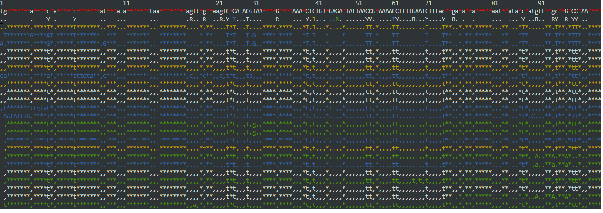

```{r}
knitr::opts_chunk$set(eval = FALSE)
```

Create and inspect and alignment files. Including visualizing and capturing "outside" graphics. Publish notebook in rpubs and provide link at top of code.

# Task 1

Looking at Alignment Files

## Download alignment data

```{r, engine='bash'}         
cd ../data
curl -O https://gannet.fish.washington.edu/seashell/bu-mox/scrubbed/120321-cvBS/19F_R1_val_1_bismark_bt2_pe.deduplicated.sorted.bam
curl -O https://gannet.fish.washington.edu/seashell/bu-mox/scrubbed/120321-cvBS/19F_R1_val_1_bismark_bt2_pe.deduplicated.sorted.bam.bai
```

```{r, engine='bash'}         
cd ../data
curl -O https://gannet.fish.washington.edu/seashell/bu-mox/data/Cvirg-genome/GCF_002022765.2_C_virginica-3.0_genomic.fa
curl -O https://gannet.fish.washington.edu/seashell/bu-mox/data/Cvirg-genome/GCF_002022765.2_C_virginica-3.0_genomic.fa.fai
```


## Visualize with tview

::: callout-important
Run the following in Terminal as is interactive
:::
Note: The `samtools` file path used below is appropriate when working on Klone. If working in Raven, use: `/home/shared/samtools-1.12/samtools`
```{r, engine='bash'}
/srlab/programs/samtools-1.20/samtools tview \
-d H \
../data/19F_R1_val_1_bismark_bt2_pe.deduplicated.sorted.bam \
../data/GCF_002022765.2_C_virginica-3.0_genomic.fa > ../output/05-alignment-data/tview.html
```

## Capture Image

Take a screen shot of the `tview` display and place in your notebook.



You can also see the full output at the HTML file `/kathleen-coral/assignments/output/05-alignment-data/tview.html`

# Task II

Aligning WGS data and visualizing in IGV

         

```{r, engine='bash'}
cd ../data
curl -O https://owl.fish.washington.edu/nightingales/C_gigas/F143n08_R2_001.fastq.gz
curl -O https://owl.fish.washington.edu/nightingales/C_gigas/F143n08_R1_001.fastq.gz
```

```{r, engine='bash'}
cd ../data
curl -O https://gannet.fish.washington.edu/panopea/Cg-roslin/cgigas_uk_roslin_v1_genomic-mito.fa
curl -O https://gannet.fish.washington.edu/panopea/Cg-roslin/cgigas_uk_roslin_v1_genomic-mito.fa.fai
curl -O https://gannet.fish.washington.edu/panopea/Cg-roslin/GCF_902806645.1_cgigas_uk_roslin_v1_genomic-mito.gtf
```


## Alignment

Again, if working on Raven, path for HiSat would be different: `/home/shared/hisat2-2.2.1/hisat2-build` 
```{r, engine='bash'}
/srlab/programs/hisat2-2.2.1/hisat2-build \
-f ../data/cgigas_uk_roslin_v1_genomic-mito.fa \
../output/05-alignment-data/cgigas_uk_roslin_v1_genomic-mito.index
```

```{r, engine='bash'}
/srlab/programs/hisat2-2.2.1/hisat2 \
-x ../output/05-alignment-data/cgigas_uk_roslin_v1_genomic-mito.index \
-p 4 \
-1 ../data/F143n08_R1_001.fastq.gz \
-2 ../data/F143n08_R2_001.fastq.gz \
-S ../output/05-alignment-data/F143_cgigas.sam
```


Take a look

```{r, engine='bash', eval=TRUE}
tail -1 ../output/05-alignment-data/F143_cgigas.sam
```

```{r, engine='bash'}
# Convert SAM to BAM, using 4 additional threads
/srlab/programs/samtools-1.20/samtools view -@ 4 -bS \
../output/05-alignment-data/F143_cgigas.sam > ../output/05-alignment-data/F143_cgigas.bam
```

```{r, engine='bash'}
# Sort the BAM file, using 4 additional threads
/srlab/programs/samtools-1.20/samtools sort -@ 4 \
../output/05-alignment-data/F143_cgigas.bam -o ../output/05-alignment-data/F143_cgigas_sorted.bam

# Index the sorted BAM file (multi-threading is not applicable to this operation)
/srlab/programs/samtools-1.20/samtools index \
../output/05-alignment-data/F143_cgigas_sorted.bam
```


## mpileup

::: callout-note
## Now bcftools is recommended for mpileup instead of samtools (which was described in textbook)
:::


```{r, engine='bash'}
/home/shared/bcftools-1.14/bcftools mpileup --threads 4 --no-BAQ \
--fasta-ref ../data/cgigas_uk_roslin_v1_genomic-mito.fa \
../output/05-alignment-data/F143_cgigas_sorted.bam > ../output/05-alignment-data/F143_mpileup_output.txt
```

```{r, engine='bash'}
tail ../output/F143_mpileup_output.txt
```

```{r, engine='bash'}
cat ../output/F143_mpileup_output.txt \
| /home/shared/bcftools-1.14/bcftools call -mv -Oz \
> ../output/05-alignment-data/F143_mpile.vcf.gz
```


```{r, engine='bash'}
zgrep "^##" -v ../output/05-alignment-data/F143_mpile.vcf.gz | \
awk 'BEGIN{OFS="\t"} {split($8, a, ";"); print $1,$2,$4,$5,$6,a[1],$9,$10}' | head

```


The code below might not work. That is fine. The VCF in the above chunk can be used for visualization in IGV.

```{r, engine='bash'}
/home/shared/bcftools-1.14/bcftools call \
-v -c ../output/05-alignment-data/F143_mpile.vcf.gz \
> ../output/05-alignment-data/F143_mpile_calls.vcf
```


## Visualize

these data in IGV and get a few cool snapshots.

Minimally show bam file, and at least 2 genome feature files.

Bonus for annotating screenshots.

Useful link: <https://robertslab.github.io/resources/Genomic-Resources/#crassostrea-gigas-cgigas_uk_roslin_v1>