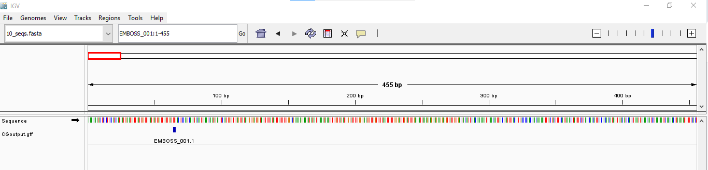

07-CG-motifs
================
Kathleen Durkin
2025-05-16

[Assignment
details](https://sr320.github.io/course-fish546-2025/assignments/07-CG.html)

Read in one of my fastas (if necessary)

``` bash
curl -L https://gannet.fish.washington.edu/gitrepos/ceasmallr/output/00.00-trimming-fastp/CF02-CM02-Zygote_R2_001.fastp-trim.fq.gz -o ../../project/data/trimmed-WGBS-reads/CF02-CM02-Zygote_R2_001.fastp-trim.fq.gz
```

Unzip fasta file and select a subset (the full file is prohibitively
large)

``` bash
gunzip ../../project/data/trimmed-WGBS-reads/CF02-CM02-Zygote_R2_001.fastp-trim.fq.gz

head -n 4000 ../../project/data/trimmed-WGBS-reads/CF02-CM02-Zygote_R2_001.fastp-trim.fq.gz > ../data/07-CG-motifs/input.fq
```

Load R packages

``` r
library(seqinr)
library(ShortRead)
```

    ## Loading required package: BiocGenerics

    ## 
    ## Attaching package: 'BiocGenerics'

    ## The following objects are masked from 'package:stats':
    ## 
    ##     IQR, mad, sd, var, xtabs

    ## The following objects are masked from 'package:base':
    ## 
    ##     anyDuplicated, aperm, append, as.data.frame, basename, cbind,
    ##     colnames, dirname, do.call, duplicated, eval, evalq, Filter, Find,
    ##     get, grep, grepl, intersect, is.unsorted, lapply, Map, mapply,
    ##     match, mget, order, paste, pmax, pmax.int, pmin, pmin.int,
    ##     Position, rank, rbind, Reduce, rownames, sapply, setdiff, sort,
    ##     table, tapply, union, unique, unsplit, which.max, which.min

    ## Loading required package: BiocParallel

    ## Loading required package: Biostrings

    ## Loading required package: S4Vectors

    ## Loading required package: stats4

    ## 
    ## Attaching package: 'S4Vectors'

    ## The following objects are masked from 'package:base':
    ## 
    ##     expand.grid, I, unname

    ## Loading required package: IRanges

    ## Loading required package: XVector

    ## Loading required package: GenomeInfoDb

    ## 
    ## Attaching package: 'Biostrings'

    ## The following object is masked from 'package:seqinr':
    ## 
    ##     translate

    ## The following object is masked from 'package:base':
    ## 
    ##     strsplit

    ## Loading required package: Rsamtools

    ## Loading required package: GenomicRanges

    ## Loading required package: GenomicAlignments

    ## Loading required package: SummarizedExperiment

    ## Loading required package: MatrixGenerics

    ## Loading required package: matrixStats

    ## 
    ## Attaching package: 'matrixStats'

    ## The following object is masked from 'package:seqinr':
    ## 
    ##     count

    ## 
    ## Attaching package: 'MatrixGenerics'

    ## The following objects are masked from 'package:matrixStats':
    ## 
    ##     colAlls, colAnyNAs, colAnys, colAvgsPerRowSet, colCollapse,
    ##     colCounts, colCummaxs, colCummins, colCumprods, colCumsums,
    ##     colDiffs, colIQRDiffs, colIQRs, colLogSumExps, colMadDiffs,
    ##     colMads, colMaxs, colMeans2, colMedians, colMins, colOrderStats,
    ##     colProds, colQuantiles, colRanges, colRanks, colSdDiffs, colSds,
    ##     colSums2, colTabulates, colVarDiffs, colVars, colWeightedMads,
    ##     colWeightedMeans, colWeightedMedians, colWeightedSds,
    ##     colWeightedVars, rowAlls, rowAnyNAs, rowAnys, rowAvgsPerColSet,
    ##     rowCollapse, rowCounts, rowCummaxs, rowCummins, rowCumprods,
    ##     rowCumsums, rowDiffs, rowIQRDiffs, rowIQRs, rowLogSumExps,
    ##     rowMadDiffs, rowMads, rowMaxs, rowMeans2, rowMedians, rowMins,
    ##     rowOrderStats, rowProds, rowQuantiles, rowRanges, rowRanks,
    ##     rowSdDiffs, rowSds, rowSums2, rowTabulates, rowVarDiffs, rowVars,
    ##     rowWeightedMads, rowWeightedMeans, rowWeightedMedians,
    ##     rowWeightedSds, rowWeightedVars

    ## Loading required package: Biobase

    ## Welcome to Bioconductor
    ## 
    ##     Vignettes contain introductory material; view with
    ##     'browseVignettes()'. To cite Bioconductor, see
    ##     'citation("Biobase")', and for packages 'citation("pkgname")'.

    ## 
    ## Attaching package: 'Biobase'

    ## The following object is masked from 'package:MatrixGenerics':
    ## 
    ##     rowMedians

    ## The following objects are masked from 'package:matrixStats':
    ## 
    ##     anyMissing, rowMedians

``` r
# Replace 'input.fasta' with the name of your multi-sequence fasta file
input_file <- "../data/07-CG-motifs/input.fq"

# Need to use silghtly different code to accomodate an .fq file instead of a .fasta
# sequences <- read.fasta(input_file)
fq <- readFastq(input_file)
sequences <- sread(fq)
```

``` r
# Set the seed for reproducibility (optional)
set.seed(42)

number_of_sequences_to_select <- 100

if (length(sequences) < number_of_sequences_to_select) {
  warning("There are fewer than 10 sequences in the fasta file. All sequences will be selected.")
  number_of_sequences_to_select <- length(sequences)
}

selected_indices <- sample(length(sequences), number_of_sequences_to_select)
selected_sequences <- sequences[selected_indices]
```

``` r
# Replace 'output.fasta' with your desired output file name
output_file <- "../output/07-CG-motifs/100_seqs.fasta"
write.fasta(selected_sequences, names(selected_sequences), output_file, open = "w")
```

Issues with IGV visualization because this generated fasta doesn’t have
matching scaffold name. Fix this here

``` bash
sed -i '1s/.*/>EMBOSS_001/' ../output/07-CG-motifs/100_seqs.fasta
```

``` bash
#needed downstream for IGV
/home/shared/samtools-1.12/samtools faidx \
../output/07-CG-motifs/100_seqs.fasta
```

``` bash
fuzznuc -sequence ../output/07-CG-motifs/100_seqs.fasta -pattern CG -rformat gff -outfile ../output/07-CG-motifs/CGoutput.gff
```

    ## Search for patterns in nucleotide sequences

IGV visualization:


