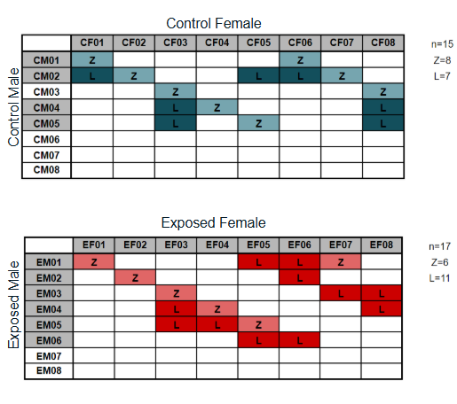

## Project background

#### Experimental design

Adult C.virginica oysters were exposed to elevated pCO2 treatment for 30 days. Following this, gonads were sampled for gametes (sperm or eggs). Fertilization crosses were performed within treatments, resulting in ControlxControl and ExposedxExposed offspring. Offspring were reared in control conditions. 9 hours post-fertilization, zygotes were sampled, and 3 days post-fertilization, larvae were sampled.

#### Data

-   WGBS for zygote and larvae offspring 

#### Reference data from prior work

-   WGBS for parent gametes (sperm and eggs)

-   RNA-seq for parent gametes (sperm and eggs)

-   Larval physiology (shell growth, shell morphology, survival)

#### Preliminary results (from prior work)

From partner studies, elevated pCO2 resulted in:

-   no DEGs in parent gametes  (did affect gene activity features like transcript expression per gene)

-   differential methylation (parental sperm and eggs)

-   parental exposure improved shell growth rate in larvae  (improvements enhanced when offspring also reared in elevated pCO2)

## Completed work

Official Github repo for the `ceasmaller` project: https://github.com/sr320/ceasmallr/tree/main

Official large-file storage (e.g., raw and trimmed reads, bismark output): https://gannet.fish.washington.edu/gitrepos/ceasmallr/output/

Steps already performed in the official repo:

1. **Trimming**. Raw WGBS FastQs were concatenated, trimmed using `fastp`, repaired if necessary using `BBtools`, and the quality-checked using `FastQC` and `MultiQC`. Details at [`ceasmallr/code/00.00-trimming-fastp.md`](https://github.com/sr320/ceasmallr/blob/main/code/00.00-trimming-fastp.md)

2. **Alignment**. Trimmed WGBS FastQs were aligned to the *C. virginica* genome using `Bismark` and `Bowtie`, then summarized using `MultiQC`. See details at [`ceasmallr/code/02.00-bismark-bowtie2-alignment.md`](https://github.com/sr320/ceasmallr/blob/main/code/02.00-bismark-bowtie2-alignment.md)

3. **Deduplication**. After reads were aligned to the *C. virginica* genome, they were deduplicated using `Bismark` to remove read duplication caused by PCR amplification during WGBS. See details at [`ceasmallr/code/02/10-bismark-deduplication.md`](https://github.com/sr320/ceasmallr/blob/main/code/02.10-bismark-deduplication.md)

4. **Methylation extraction**. `Bismark` was used to call the methylation state of all sequenced cytosine positions. See details at [`ceasmallr/code/02.20-bismark-methylation-extraction.md`](https://github.com/sr320/ceasmallr/blob/main/code/02.20-bismark-methylation-extraction.md)

Several of the above steps are noted to have very long run times (e.g., 2 weeks to complete alignment), so I will not be replicating them in this repo. Instead, I will use the processed methylation calls to begin differential methylation analysis. 

## How to work in this repo

The repo is structured into three primary directories: 

-   `code`

-   `data`

-   `output`

All scripts, R code, and rendered `.md` and `.html` files should be stored in `code`. All input data (e.g., genomes) should be stored in `data`. All output files from running code should be stored in `output`. Note that files larger then 100 MB cannot be stored on Github.

In `code`, files will be organized with a numerical prefix. Each distinct task should be performed in its own code file with its own two-digit number. For example:

-   `01-trimming.Rmd`

-   `02-alignment.Rmd`

-   `03-deduplication.Rmd`

In `output`, the outputs from a given script should be stored in a subdirectory of the same name. For example, with the above scripts, we would have the following subdirectories in `output`:

-   `01-trimming`

-   `02-alignment`

-   `03-deduplication`

To maintain the document numbering in the [`ceasmallr` repo](https://github.com/sr320/ceasmallr/tree/main), I'll begin differential methylation analysis with the `06-` prefix.
