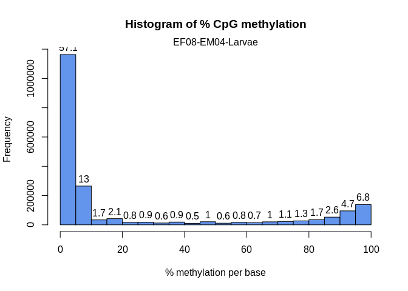

06-differential-methylation
================
Kathleen Durkin
2025-04-22

- <a href="#1-download-methylation-calls"
  id="toc-1-download-methylation-calls">1 Download methylation calls</a>
- <a href="#2-methylkit" id="toc-2-methylkit">2 methylKit</a>
- <a href="#3-create-object" id="toc-3-create-object">3 Create object</a>
- <a href="#4-descriptive-statistics" id="toc-4-descriptive-statistics">4
  Descriptive statistics</a>
- <a href="#5-filter" id="toc-5-filter">5 Filter</a>
- <a href="#6-normalization" id="toc-6-normalization">6 Normalization</a>
- <a href="#7-merge" id="toc-7-merge">7 Merge</a>
- <a href="#8-filter-2" id="toc-8-filter-2">8 Filter 2</a>
- <a href="#9-data-structureoutlier-detection"
  id="toc-9-data-structureoutlier-detection">9 Data structure/Outlier
  detection</a>
- <a href="#10-differential-methylation"
  id="toc-10-differential-methylation">10 DIfferential methylation</a>
  - <a href="#101-cpg-sites" id="toc-101-cpg-sites">10.1 CpG sites</a>

Performing differential methylation analysis using the `methylkit`
package.

Inputs:

- Methylation calls extracted from WGBS reads using `Bismark`:
  `[].fastp-trim_bismark_bt2_pe.deduplicated.bismark.cov.gz`, stored on
  [Gannet](https://gannet.fish.washington.edu/gitrepos/ceasmallr/output/02.20-bismark-methylation-extraction/)

# 1 Download methylation calls

``` bash
# Run wget to retrieve FastQs and MD5 files
# Note: the --no-clobber command will skip re-downloading any files that are already present in the output directory
wget \
--directory-prefix ../data/bismark-methyl-extraction \
--recursive \
--no-check-certificate \
--continue \
--cut-dirs 4 \
--no-host-directories \
--no-parent \
--quiet \
--no-clobber \
--accept="*.deduplicated.bismark.cov.gz,checksums.md5" https://gannet.fish.washington.edu/gitrepos/ceasmallr/output/02.20-bismark-methylation-extraction/
```

``` bash
cd ../data/bismark-methyl-extraction/

echo "How many methylation calling files were downloaded?"
ls *.deduplicated.bismark.cov.gz | wc -l

echo ""

echo "Check file checksums:"
grep '.deduplicated.bismark.cov.gz' checksums.md5 | md5sum -c -
```

    ## How many methylation calling files were downloaded?
    ## 32
    ## 
    ## Check file checksums:
    ## CF01-CM01-Zygote_R1_001.fastp-trim.REPAIRED_bismark_bt2_pe.deduplicated.bismark.cov.gz: OK
    ## CF01-CM02-Larvae_R1_001.fastp-trim_bismark_bt2_pe.deduplicated.bismark.cov.gz: OK
    ## CF02-CM02-Zygote_R1_001.fastp-trim_bismark_bt2_pe.deduplicated.bismark.cov.gz: OK
    ## CF03-CM03-Zygote_R1_001.fastp-trim_bismark_bt2_pe.deduplicated.bismark.cov.gz: OK
    ## CF03-CM04-Larvae_R1_001.fastp-trim_bismark_bt2_pe.deduplicated.bismark.cov.gz: OK
    ## CF03-CM05-Larvae_R1_001.fastp-trim_bismark_bt2_pe.deduplicated.bismark.cov.gz: OK
    ## CF04-CM04-Zygote_R1_001.fastp-trim_bismark_bt2_pe.deduplicated.bismark.cov.gz: OK
    ## CF05-CM02-Larvae_R1_001.fastp-trim_bismark_bt2_pe.deduplicated.bismark.cov.gz: OK
    ## CF05-CM05-Zygote_R1_001.fastp-trim_bismark_bt2_pe.deduplicated.bismark.cov.gz: OK
    ## CF06-CM01-Zygote_R1_001.fastp-trim_bismark_bt2_pe.deduplicated.bismark.cov.gz: OK
    ## CF06-CM02-Larvae_R1_001.fastp-trim_bismark_bt2_pe.deduplicated.bismark.cov.gz: OK
    ## CF07-CM02-Zygote_R1_001.fastp-trim_bismark_bt2_pe.deduplicated.bismark.cov.gz: OK
    ## CF08-CM03-Zygote_R1_001.fastp-trim_bismark_bt2_pe.deduplicated.bismark.cov.gz: OK
    ## CF08-CM04-Larvae_R1_001.fastp-trim.REPAIRED_bismark_bt2_pe.deduplicated.bismark.cov.gz: OK
    ## CF08-CM05-Larvae_R1_001.fastp-trim_bismark_bt2_pe.deduplicated.bismark.cov.gz: OK
    ## EF01-EM01-Zygote_R1_001.fastp-trim_bismark_bt2_pe.deduplicated.bismark.cov.gz: OK
    ## EF02-EM02-Zygote_R1_001.fastp-trim_bismark_bt2_pe.deduplicated.bismark.cov.gz: OK
    ## EF03-EM03-Zygote_R1_001.fastp-trim.REPAIRED_bismark_bt2_pe.deduplicated.bismark.cov.gz: OK
    ## EF03-EM04-Larvae_R1_001.fastp-trim_bismark_bt2_pe.deduplicated.bismark.cov.gz: OK
    ## EF03-EM05-Larvae_R1_001.fastp-trim_bismark_bt2_pe.deduplicated.bismark.cov.gz: OK
    ## EF04-EM04-Zygote_R1_001.fastp-trim_bismark_bt2_pe.deduplicated.bismark.cov.gz: OK
    ## EF04-EM05-Larvae_R1_001.fastp-trim_bismark_bt2_pe.deduplicated.bismark.cov.gz: OK
    ## EF05-EM01-Larvae_R1_001.fastp-trim_bismark_bt2_pe.deduplicated.bismark.cov.gz: OK
    ## EF05-EM05-Zygote_R1_001.fastp-trim_bismark_bt2_pe.deduplicated.bismark.cov.gz: OK
    ## EF05-EM06-Larvae_R1_001.fastp-trim_bismark_bt2_pe.deduplicated.bismark.cov.gz: OK
    ## EF06-EM01-Larvae_R1_001.fastp-trim_bismark_bt2_pe.deduplicated.bismark.cov.gz: OK
    ## EF06-EM02-Larvae_R1_001.fastp-trim_bismark_bt2_pe.deduplicated.bismark.cov.gz: OK
    ## EF06-EM06-Larvae_R1_001.fastp-trim_bismark_bt2_pe.deduplicated.bismark.cov.gz: OK
    ## EF07-EM01-Zygote_R1_001.fastp-trim_bismark_bt2_pe.deduplicated.bismark.cov.gz: OK
    ## EF07-EM03-Larvae_R1_001.fastp-trim_bismark_bt2_pe.deduplicated.bismark.cov.gz: OK
    ## EF08-EM03-Larvae_R1_001.fastp-trim_bismark_bt2_pe.deduplicated.bismark.cov.gz: OK
    ## EF08-EM04-Larvae_R1_001.fastp-trim_bismark_bt2_pe.deduplicated.bismark.cov.gz: OK

We should have N=32 (n=15 ControlxControl crosses, n=17 ExposedxExposed
crosses)

# 2 methylKit

Load packages

``` r
# Install packages if necessary
# if (!require("BiocManager", quietly = TRUE))
#     install.packages("BiocManager")
# BiocManager::install("methylKit")
# BiocManager::install("genomation")

# Load
library(tidyr)
library(dplyr)
```

    ## 
    ## Attaching package: 'dplyr'

    ## The following objects are masked from 'package:stats':
    ## 
    ##     filter, lag

    ## The following objects are masked from 'package:base':
    ## 
    ##     intersect, setdiff, setequal, union

``` r
library(methylKit)
```

    ## Loading required package: GenomicRanges

    ## Loading required package: stats4

    ## Loading required package: BiocGenerics

    ## 
    ## Attaching package: 'BiocGenerics'

    ## The following objects are masked from 'package:dplyr':
    ## 
    ##     combine, intersect, setdiff, union

    ## The following objects are masked from 'package:stats':
    ## 
    ##     IQR, mad, sd, var, xtabs

    ## The following objects are masked from 'package:base':
    ## 
    ##     anyDuplicated, aperm, append, as.data.frame, basename, cbind,
    ##     colnames, dirname, do.call, duplicated, eval, evalq, Filter, Find,
    ##     get, grep, grepl, intersect, is.unsorted, lapply, Map, mapply,
    ##     match, mget, order, paste, pmax, pmax.int, pmin, pmin.int,
    ##     Position, rank, rbind, Reduce, rownames, sapply, setdiff, sort,
    ##     table, tapply, union, unique, unsplit, which.max, which.min

    ## Loading required package: S4Vectors

    ## 
    ## Attaching package: 'S4Vectors'

    ## The following objects are masked from 'package:dplyr':
    ## 
    ##     first, rename

    ## The following object is masked from 'package:tidyr':
    ## 
    ##     expand

    ## The following objects are masked from 'package:base':
    ## 
    ##     expand.grid, I, unname

    ## Loading required package: IRanges

    ## 
    ## Attaching package: 'IRanges'

    ## The following objects are masked from 'package:dplyr':
    ## 
    ##     collapse, desc, slice

    ## Loading required package: GenomeInfoDb

    ## 
    ## Attaching package: 'methylKit'

    ## The following object is masked from 'package:dplyr':
    ## 
    ##     select

    ## The following object is masked from 'package:tidyr':
    ## 
    ##     unite

``` r
library(genomation)
```

    ## Loading required package: grid

    ## Warning: replacing previous import 'Biostrings::pattern' by 'grid::pattern'
    ## when loading 'genomation'

    ## 
    ## Attaching package: 'genomation'

    ## The following objects are masked from 'package:methylKit':
    ## 
    ##     getFeatsWithTargetsStats, getFlanks, getMembers,
    ##     getTargetAnnotationStats, plotTargetAnnotation

``` r
library(GenomicRanges)
library(gridExtra)
```

    ## 
    ## Attaching package: 'gridExtra'

    ## The following object is masked from 'package:BiocGenerics':
    ## 
    ##     combine

    ## The following object is masked from 'package:dplyr':
    ## 
    ##     combine

``` r
library(ggplot2)
```

Using tutorial:
<https://nbis-workshop-epigenomics.readthedocs.io/en/latest/content/tutorials/methylationSeq/Seq_Tutorial.html#introduction>

# 3 Create object

``` r
# Define path to my samples directory
data_dir <- "../data/bismark-methyl-extraction"

# List all .bismark.cov.gz files in the samples directory
file.list <- list.files(path = data_dir, pattern = "\\.bismark.cov.gz$", full.names = TRUE)
# Exclude CF08-CM04-Larvae and CF08-CM05-Larvae (very low coverage and methylation)
file.list <- file.list[!grepl("CF08-CM04-Larvae|CF08-CM05-Larvae", file.list)]

# Extract just the filenames
file.names <- basename(file.list)

# Create sample IDs by stripping file extensions
sample.ids <- sub("_R1_001.fastp-trim_bismark_bt2_pe.deduplicated.bismark.cov.gz", "", file.names)
sample.ids <- sub("_R1_001.fastp-trim.REPAIRED_bismark_bt2_pe.deduplicated.bismark.cov.gz", ".REP", sample.ids)


# Assign treatment based on first letter of filename
# E = parents exposed to OA treatment
# C = parents held in control
treatment <- ifelse(startsWith(file.names, "E"), 1,
                    ifelse(startsWith(file.names, "C"), 0, NA))

# Read in methylation data
myobj <- methRead(as.list(file.list),
  sample.id = as.list(sample.ids),
  pipeline = "bismarkCoverage",
  assembly = "mm10",
  treatment = treatment,
  mincov = 10
)
```

    ## Received list of locations.

    ## Uncompressing file.

    ## Reading file.

    ## Uncompressing file.

    ## Reading file.

    ## Uncompressing file.

    ## Reading file.

    ## Uncompressing file.

    ## Reading file.

    ## Uncompressing file.

    ## Reading file.

    ## Uncompressing file.

    ## Reading file.

    ## Uncompressing file.

    ## Reading file.

    ## Uncompressing file.

    ## Reading file.

    ## Uncompressing file.

    ## Reading file.

    ## Uncompressing file.

    ## Reading file.

    ## Uncompressing file.

    ## Reading file.

    ## Uncompressing file.

    ## Reading file.

    ## Uncompressing file.

    ## Reading file.

    ## Uncompressing file.

    ## Reading file.

    ## Uncompressing file.

    ## Reading file.

    ## Uncompressing file.

    ## Reading file.

    ## Uncompressing file.

    ## Reading file.

    ## Uncompressing file.

    ## Reading file.

    ## Uncompressing file.

    ## Reading file.

    ## Uncompressing file.

    ## Reading file.

    ## Uncompressing file.

    ## Reading file.

    ## Uncompressing file.

    ## Reading file.

    ## Uncompressing file.

    ## Reading file.

    ## Uncompressing file.

    ## Reading file.

    ## Uncompressing file.

    ## Reading file.

    ## Uncompressing file.

    ## Reading file.

    ## Uncompressing file.

    ## Reading file.

    ## Uncompressing file.

    ## Reading file.

    ## Uncompressing file.

    ## Reading file.

    ## Uncompressing file.

    ## Reading file.

``` r
# Inspect
str(myobj)
```

    ## Formal class 'methylRawList' [package "methylKit"] with 2 slots
    ##   ..@ .Data    :List of 30
    ##   .. ..$ :'data.frame':  6849 obs. of  7 variables:
    ## Formal class 'methylRaw' [package "methylKit"] with 8 slots
    ##   .. .. .. ..@ .Data     :List of 7
    ##   .. .. .. .. ..$ : chr [1:6849] "NC_007175.2" "NC_007175.2" "NC_007175.2" "NC_007175.2" ...
    ##   .. .. .. .. ..$ : int [1:6849] 51 88 89 147 148 193 194 246 257 264 ...
    ##   .. .. .. .. ..$ : int [1:6849] 51 88 89 147 148 193 194 246 257 264 ...
    ##   .. .. .. .. ..$ : chr [1:6849] "*" "*" "*" "*" ...
    ##   .. .. .. .. ..$ : int [1:6849] 52 104 33 116 57 51 39 61 114 150 ...
    ##   .. .. .. .. ..$ : int [1:6849] 1 0 0 0 1 0 0 2 5 0 ...
    ##   .. .. .. .. ..$ : int [1:6849] 51 104 33 116 56 51 39 59 109 150 ...
    ##   .. .. .. ..@ sample.id : chr "CF01-CM01-Zygote.REP"
    ##   .. .. .. ..@ assembly  : chr "mm10"
    ##   .. .. .. ..@ context   : chr "CpG"
    ##   .. .. .. ..@ resolution: chr "base"
    ##   .. .. .. ..@ names     : chr [1:7] "chr" "start" "end" "strand" ...
    ##   .. .. .. ..@ row.names : int [1:6849] 1 2 3 4 5 6 7 8 9 10 ...
    ##   .. .. .. ..@ .S3Class  : chr "data.frame"
    ##   .. ..$ :'data.frame':  2787371 obs. of  7 variables:
    ## Formal class 'methylRaw' [package "methylKit"] with 8 slots
    ##   .. .. .. ..@ .Data     :List of 7
    ##   .. .. .. .. ..$ : chr [1:2787371] "NC_007175.2" "NC_007175.2" "NC_007175.2" "NC_007175.2" ...
    ##   .. .. .. .. ..$ : int [1:2787371] 50 51 52 88 89 147 148 193 194 246 ...
    ##   .. .. .. .. ..$ : int [1:2787371] 50 51 52 88 89 147 148 193 194 246 ...
    ##   .. .. .. .. ..$ : chr [1:2787371] "*" "*" "*" "*" ...
    ##   .. .. .. .. ..$ : int [1:2787371] 15 59 16 113 184 163 188 211 142 221 ...
    ##   .. .. .. .. ..$ : int [1:2787371] 0 1 0 4 3 0 3 1 0 3 ...
    ##   .. .. .. .. ..$ : int [1:2787371] 15 58 16 109 181 163 185 210 142 218 ...
    ##   .. .. .. ..@ sample.id : chr "CF01-CM02-Larvae"
    ##   .. .. .. ..@ assembly  : chr "mm10"
    ##   .. .. .. ..@ context   : chr "CpG"
    ##   .. .. .. ..@ resolution: chr "base"
    ##   .. .. .. ..@ names     : chr [1:7] "chr" "start" "end" "strand" ...
    ##   .. .. .. ..@ row.names : int [1:2787371] 1 2 3 4 5 6 7 8 9 10 ...
    ##   .. .. .. ..@ .S3Class  : chr "data.frame"
    ##   .. ..$ :'data.frame':  274259 obs. of  7 variables:
    ## Formal class 'methylRaw' [package "methylKit"] with 8 slots
    ##   .. .. .. ..@ .Data     :List of 7
    ##   .. .. .. .. ..$ : chr [1:274259] "NC_007175.2" "NC_007175.2" "NC_007175.2" "NC_007175.2" ...
    ##   .. .. .. .. ..$ : int [1:274259] 49 50 51 52 88 89 147 148 193 194 ...
    ##   .. .. .. .. ..$ : int [1:274259] 49 50 51 52 88 89 147 148 193 194 ...
    ##   .. .. .. .. ..$ : chr [1:274259] "*" "*" "*" "*" ...
    ##   .. .. .. .. ..$ : int [1:274259] 80 19 82 19 206 173 235 257 63 145 ...
    ##   .. .. .. .. ..$ : int [1:274259] 3 2 2 0 10 9 6 12 1 5 ...
    ##   .. .. .. .. ..$ : int [1:274259] 77 17 80 19 196 164 229 245 62 140 ...
    ##   .. .. .. ..@ sample.id : chr "CF02-CM02-Zygote"
    ##   .. .. .. ..@ assembly  : chr "mm10"
    ##   .. .. .. ..@ context   : chr "CpG"
    ##   .. .. .. ..@ resolution: chr "base"
    ##   .. .. .. ..@ names     : chr [1:7] "chr" "start" "end" "strand" ...
    ##   .. .. .. ..@ row.names : int [1:274259] 1 2 3 4 5 6 7 8 9 10 ...
    ##   .. .. .. ..@ .S3Class  : chr "data.frame"
    ##   .. ..$ :'data.frame':  596118 obs. of  7 variables:
    ## Formal class 'methylRaw' [package "methylKit"] with 8 slots
    ##   .. .. .. ..@ .Data     :List of 7
    ##   .. .. .. .. ..$ : chr [1:596118] "NC_007175.2" "NC_007175.2" "NC_007175.2" "NC_007175.2" ...
    ##   .. .. .. .. ..$ : int [1:596118] 50 51 52 88 89 147 148 193 194 246 ...
    ##   .. .. .. .. ..$ : int [1:596118] 50 51 52 88 89 147 148 193 194 246 ...
    ##   .. .. .. .. ..$ : chr [1:596118] "*" "*" "*" "*" ...
    ##   .. .. .. .. ..$ : int [1:596118] 25 51 29 101 325 107 397 84 237 107 ...
    ##   .. .. .. .. ..$ : int [1:596118] 0 2 0 1 6 1 12 3 6 2 ...
    ##   .. .. .. .. ..$ : int [1:596118] 25 49 29 100 319 106 385 81 231 105 ...
    ##   .. .. .. ..@ sample.id : chr "CF03-CM03-Zygote"
    ##   .. .. .. ..@ assembly  : chr "mm10"
    ##   .. .. .. ..@ context   : chr "CpG"
    ##   .. .. .. ..@ resolution: chr "base"
    ##   .. .. .. ..@ names     : chr [1:7] "chr" "start" "end" "strand" ...
    ##   .. .. .. ..@ row.names : int [1:596118] 1 2 3 4 5 6 7 8 9 10 ...
    ##   .. .. .. ..@ .S3Class  : chr "data.frame"
    ##   .. ..$ :'data.frame':  1960777 obs. of  7 variables:
    ## Formal class 'methylRaw' [package "methylKit"] with 8 slots
    ##   .. .. .. ..@ .Data     :List of 7
    ##   .. .. .. .. ..$ : chr [1:1960777] "NC_007175.2" "NC_007175.2" "NC_007175.2" "NC_007175.2" ...
    ##   .. .. .. .. ..$ : int [1:1960777] 51 88 89 147 148 193 194 246 247 257 ...
    ##   .. .. .. .. ..$ : int [1:1960777] 51 88 89 147 148 193 194 246 247 257 ...
    ##   .. .. .. .. ..$ : chr [1:1960777] "*" "*" "*" "*" ...
    ##   .. .. .. .. ..$ : int [1:1960777] 44 92 83 127 70 231 55 242 35 256 ...
    ##   .. .. .. .. ..$ : int [1:1960777] 4 2 0 3 1 8 1 8 1 4 ...
    ##   .. .. .. .. ..$ : int [1:1960777] 40 90 83 124 69 223 54 234 34 252 ...
    ##   .. .. .. ..@ sample.id : chr "CF03-CM04-Larvae"
    ##   .. .. .. ..@ assembly  : chr "mm10"
    ##   .. .. .. ..@ context   : chr "CpG"
    ##   .. .. .. ..@ resolution: chr "base"
    ##   .. .. .. ..@ names     : chr [1:7] "chr" "start" "end" "strand" ...
    ##   .. .. .. ..@ row.names : int [1:1960777] 1 2 3 4 5 6 7 8 9 10 ...
    ##   .. .. .. ..@ .S3Class  : chr "data.frame"
    ##   .. ..$ :'data.frame':  2471065 obs. of  7 variables:
    ## Formal class 'methylRaw' [package "methylKit"] with 8 slots
    ##   .. .. .. ..@ .Data     :List of 7
    ##   .. .. .. .. ..$ : chr [1:2471065] "NC_007175.2" "NC_007175.2" "NC_007175.2" "NC_007175.2" ...
    ##   .. .. .. .. ..$ : int [1:2471065] 50 51 52 88 89 147 148 193 194 246 ...
    ##   .. .. .. .. ..$ : int [1:2471065] 50 51 52 88 89 147 148 193 194 246 ...
    ##   .. .. .. .. ..$ : chr [1:2471065] "*" "*" "*" "*" ...
    ##   .. .. .. .. ..$ : int [1:2471065] 10 17 11 38 130 58 147 114 109 150 ...
    ##   .. .. .. .. ..$ : int [1:2471065] 0 1 0 1 1 2 4 6 4 5 ...
    ##   .. .. .. .. ..$ : int [1:2471065] 10 16 11 37 129 56 143 108 105 145 ...
    ##   .. .. .. ..@ sample.id : chr "CF03-CM05-Larvae"
    ##   .. .. .. ..@ assembly  : chr "mm10"
    ##   .. .. .. ..@ context   : chr "CpG"
    ##   .. .. .. ..@ resolution: chr "base"
    ##   .. .. .. ..@ names     : chr [1:7] "chr" "start" "end" "strand" ...
    ##   .. .. .. ..@ row.names : int [1:2471065] 1 2 3 4 5 6 7 8 9 10 ...
    ##   .. .. .. ..@ .S3Class  : chr "data.frame"
    ##   .. ..$ :'data.frame':  745966 obs. of  7 variables:
    ## Formal class 'methylRaw' [package "methylKit"] with 8 slots
    ##   .. .. .. ..@ .Data     :List of 7
    ##   .. .. .. .. ..$ : chr [1:745966] "NC_007175.2" "NC_007175.2" "NC_007175.2" "NC_007175.2" ...
    ##   .. .. .. .. ..$ : int [1:745966] 50 51 52 88 89 147 148 149 193 194 ...
    ##   .. .. .. .. ..$ : int [1:745966] 50 51 52 88 89 147 148 149 193 194 ...
    ##   .. .. .. .. ..$ : chr [1:745966] "*" "*" "*" "*" ...
    ##   .. .. .. .. ..$ : int [1:745966] 85 116 99 252 669 323 731 13 263 496 ...
    ##   .. .. .. .. ..$ : int [1:745966] 1 1 1 8 9 8 21 0 8 9 ...
    ##   .. .. .. .. ..$ : int [1:745966] 84 115 98 244 660 315 710 13 255 487 ...
    ##   .. .. .. ..@ sample.id : chr "CF04-CM04-Zygote"
    ##   .. .. .. ..@ assembly  : chr "mm10"
    ##   .. .. .. ..@ context   : chr "CpG"
    ##   .. .. .. ..@ resolution: chr "base"
    ##   .. .. .. ..@ names     : chr [1:7] "chr" "start" "end" "strand" ...
    ##   .. .. .. ..@ row.names : int [1:745966] 1 2 3 4 5 6 7 8 9 10 ...
    ##   .. .. .. ..@ .S3Class  : chr "data.frame"
    ##   .. ..$ :'data.frame':  3717313 obs. of  7 variables:
    ## Formal class 'methylRaw' [package "methylKit"] with 8 slots
    ##   .. .. .. ..@ .Data     :List of 7
    ##   .. .. .. .. ..$ : chr [1:3717313] "NC_007175.2" "NC_007175.2" "NC_007175.2" "NC_007175.2" ...
    ##   .. .. .. .. ..$ : int [1:3717313] 51 88 89 147 148 193 194 246 247 257 ...
    ##   .. .. .. .. ..$ : int [1:3717313] 51 88 89 147 148 193 194 246 247 257 ...
    ##   .. .. .. .. ..$ : chr [1:3717313] "*" "*" "*" "*" ...
    ##   .. .. .. .. ..$ : int [1:3717313] 24 50 77 85 80 110 61 124 11 139 ...
    ##   .. .. .. .. ..$ : int [1:3717313] 0 1 0 0 0 1 0 0 0 1 ...
    ##   .. .. .. .. ..$ : int [1:3717313] 24 49 77 85 80 109 61 124 11 138 ...
    ##   .. .. .. ..@ sample.id : chr "CF05-CM02-Larvae"
    ##   .. .. .. ..@ assembly  : chr "mm10"
    ##   .. .. .. ..@ context   : chr "CpG"
    ##   .. .. .. ..@ resolution: chr "base"
    ##   .. .. .. ..@ names     : chr [1:7] "chr" "start" "end" "strand" ...
    ##   .. .. .. ..@ row.names : int [1:3717313] 1 2 3 4 5 6 7 8 9 10 ...
    ##   .. .. .. ..@ .S3Class  : chr "data.frame"
    ##   .. ..$ :'data.frame':  1295363 obs. of  7 variables:
    ## Formal class 'methylRaw' [package "methylKit"] with 8 slots
    ##   .. .. .. ..@ .Data     :List of 7
    ##   .. .. .. .. ..$ : chr [1:1295363] "NC_007175.2" "NC_007175.2" "NC_007175.2" "NC_007175.2" ...
    ##   .. .. .. .. ..$ : int [1:1295363] 50 51 52 88 89 147 148 149 193 194 ...
    ##   .. .. .. .. ..$ : int [1:1295363] 50 51 52 88 89 147 148 149 193 194 ...
    ##   .. .. .. .. ..$ : chr [1:1295363] "*" "*" "*" "*" ...
    ##   .. .. .. .. ..$ : int [1:1295363] 107 110 113 239 855 373 902 19 435 635 ...
    ##   .. .. .. .. ..$ : int [1:1295363] 4 2 2 7 19 8 18 1 12 14 ...
    ##   .. .. .. .. ..$ : int [1:1295363] 103 108 111 232 836 365 884 18 423 621 ...
    ##   .. .. .. ..@ sample.id : chr "CF05-CM05-Zygote"
    ##   .. .. .. ..@ assembly  : chr "mm10"
    ##   .. .. .. ..@ context   : chr "CpG"
    ##   .. .. .. ..@ resolution: chr "base"
    ##   .. .. .. ..@ names     : chr [1:7] "chr" "start" "end" "strand" ...
    ##   .. .. .. ..@ row.names : int [1:1295363] 1 2 3 4 5 6 7 8 9 10 ...
    ##   .. .. .. ..@ .S3Class  : chr "data.frame"
    ##   .. ..$ :'data.frame':  716129 obs. of  7 variables:
    ## Formal class 'methylRaw' [package "methylKit"] with 8 slots
    ##   .. .. .. ..@ .Data     :List of 7
    ##   .. .. .. .. ..$ : chr [1:716129] "NC_007175.2" "NC_007175.2" "NC_007175.2" "NC_007175.2" ...
    ##   .. .. .. .. ..$ : int [1:716129] 50 51 52 88 89 147 148 193 194 246 ...
    ##   .. .. .. .. ..$ : int [1:716129] 50 51 52 88 89 147 148 193 194 246 ...
    ##   .. .. .. .. ..$ : chr [1:716129] "*" "*" "*" "*" ...
    ##   .. .. .. .. ..$ : int [1:716129] 51 65 59 143 467 172 569 134 358 151 ...
    ##   .. .. .. .. ..$ : int [1:716129] 2 4 0 5 10 4 20 3 6 11 ...
    ##   .. .. .. .. ..$ : int [1:716129] 49 61 59 138 457 168 549 131 352 140 ...
    ##   .. .. .. ..@ sample.id : chr "CF06-CM01-Zygote"
    ##   .. .. .. ..@ assembly  : chr "mm10"
    ##   .. .. .. ..@ context   : chr "CpG"
    ##   .. .. .. ..@ resolution: chr "base"
    ##   .. .. .. ..@ names     : chr [1:7] "chr" "start" "end" "strand" ...
    ##   .. .. .. ..@ row.names : int [1:716129] 1 2 3 4 5 6 7 8 9 10 ...
    ##   .. .. .. ..@ .S3Class  : chr "data.frame"
    ##   .. ..$ :'data.frame':  649349 obs. of  7 variables:
    ## Formal class 'methylRaw' [package "methylKit"] with 8 slots
    ##   .. .. .. ..@ .Data     :List of 7
    ##   .. .. .. .. ..$ : chr [1:649349] "NC_007175.2" "NC_007175.2" "NC_007175.2" "NC_007175.2" ...
    ##   .. .. .. .. ..$ : int [1:649349] 50 52 89 147 148 193 194 246 247 257 ...
    ##   .. .. .. .. ..$ : int [1:649349] 50 52 89 147 148 193 194 246 247 257 ...
    ##   .. .. .. .. ..$ : chr [1:649349] "*" "*" "*" "*" ...
    ##   .. .. .. .. ..$ : int [1:649349] 12 14 136 13 140 10 91 16 31 20 ...
    ##   .. .. .. .. ..$ : int [1:649349] 0 2 0 0 8 0 4 1 2 1 ...
    ##   .. .. .. .. ..$ : int [1:649349] 12 12 136 13 132 10 87 15 29 19 ...
    ##   .. .. .. ..@ sample.id : chr "CF06-CM02-Larvae"
    ##   .. .. .. ..@ assembly  : chr "mm10"
    ##   .. .. .. ..@ context   : chr "CpG"
    ##   .. .. .. ..@ resolution: chr "base"
    ##   .. .. .. ..@ names     : chr [1:7] "chr" "start" "end" "strand" ...
    ##   .. .. .. ..@ row.names : int [1:649349] 1 2 3 4 5 6 7 8 9 10 ...
    ##   .. .. .. ..@ .S3Class  : chr "data.frame"
    ##   .. ..$ :'data.frame':  183710 obs. of  7 variables:
    ## Formal class 'methylRaw' [package "methylKit"] with 8 slots
    ##   .. .. .. ..@ .Data     :List of 7
    ##   .. .. .. .. ..$ : chr [1:183710] "NC_007175.2" "NC_007175.2" "NC_007175.2" "NC_007175.2" ...
    ##   .. .. .. .. ..$ : int [1:183710] 50 51 52 88 89 147 148 193 194 246 ...
    ##   .. .. .. .. ..$ : int [1:183710] 50 51 52 88 89 147 148 193 194 246 ...
    ##   .. .. .. .. ..$ : chr [1:183710] "*" "*" "*" "*" ...
    ##   .. .. .. .. ..$ : int [1:183710] 86 205 102 483 586 587 611 514 385 571 ...
    ##   .. .. .. .. ..$ : int [1:183710] 2 1 0 6 5 4 9 10 2 10 ...
    ##   .. .. .. .. ..$ : int [1:183710] 84 204 102 477 581 583 602 504 383 561 ...
    ##   .. .. .. ..@ sample.id : chr "CF07-CM02-Zygote"
    ##   .. .. .. ..@ assembly  : chr "mm10"
    ##   .. .. .. ..@ context   : chr "CpG"
    ##   .. .. .. ..@ resolution: chr "base"
    ##   .. .. .. ..@ names     : chr [1:7] "chr" "start" "end" "strand" ...
    ##   .. .. .. ..@ row.names : int [1:183710] 1 2 3 4 5 6 7 8 9 10 ...
    ##   .. .. .. ..@ .S3Class  : chr "data.frame"
    ##   .. ..$ :'data.frame':  313301 obs. of  7 variables:
    ## Formal class 'methylRaw' [package "methylKit"] with 8 slots
    ##   .. .. .. ..@ .Data     :List of 7
    ##   .. .. .. .. ..$ : chr [1:313301] "NC_007175.2" "NC_007175.2" "NC_007175.2" "NC_007175.2" ...
    ##   .. .. .. .. ..$ : int [1:313301] 49 50 51 52 88 89 147 148 193 194 ...
    ##   .. .. .. .. ..$ : int [1:313301] 49 50 51 52 88 89 147 148 193 194 ...
    ##   .. .. .. .. ..$ : chr [1:313301] "*" "*" "*" "*" ...
    ##   .. .. .. .. ..$ : int [1:313301] 106 36 110 37 241 357 266 453 79 254 ...
    ##   .. .. .. .. ..$ : int [1:313301] 2 0 4 1 11 4 7 6 3 5 ...
    ##   .. .. .. .. ..$ : int [1:313301] 104 36 106 36 230 353 259 447 76 249 ...
    ##   .. .. .. ..@ sample.id : chr "CF08-CM03-Zygote"
    ##   .. .. .. ..@ assembly  : chr "mm10"
    ##   .. .. .. ..@ context   : chr "CpG"
    ##   .. .. .. ..@ resolution: chr "base"
    ##   .. .. .. ..@ names     : chr [1:7] "chr" "start" "end" "strand" ...
    ##   .. .. .. ..@ row.names : int [1:313301] 1 2 3 4 5 6 7 8 9 10 ...
    ##   .. .. .. ..@ .S3Class  : chr "data.frame"
    ##   .. ..$ :'data.frame':  689453 obs. of  7 variables:
    ## Formal class 'methylRaw' [package "methylKit"] with 8 slots
    ##   .. .. .. ..@ .Data     :List of 7
    ##   .. .. .. .. ..$ : chr [1:689453] "NC_007175.2" "NC_007175.2" "NC_007175.2" "NC_007175.2" ...
    ##   .. .. .. .. ..$ : int [1:689453] 50 51 52 88 89 147 148 149 193 194 ...
    ##   .. .. .. .. ..$ : int [1:689453] 50 51 52 88 89 147 148 149 193 194 ...
    ##   .. .. .. .. ..$ : chr [1:689453] "*" "*" "*" "*" ...
    ##   .. .. .. .. ..$ : int [1:689453] 105 44 112 81 1070 114 1217 21 127 869 ...
    ##   .. .. .. .. ..$ : int [1:689453] 8 0 7 3 26 4 42 2 5 28 ...
    ##   .. .. .. .. ..$ : int [1:689453] 97 44 105 78 1044 110 1175 19 122 841 ...
    ##   .. .. .. ..@ sample.id : chr "EF01-EM01-Zygote"
    ##   .. .. .. ..@ assembly  : chr "mm10"
    ##   .. .. .. ..@ context   : chr "CpG"
    ##   .. .. .. ..@ resolution: chr "base"
    ##   .. .. .. ..@ names     : chr [1:7] "chr" "start" "end" "strand" ...
    ##   .. .. .. ..@ row.names : int [1:689453] 1 2 3 4 5 6 7 8 9 10 ...
    ##   .. .. .. ..@ .S3Class  : chr "data.frame"
    ##   .. ..$ :'data.frame':  1035967 obs. of  7 variables:
    ## Formal class 'methylRaw' [package "methylKit"] with 8 slots
    ##   .. .. .. ..@ .Data     :List of 7
    ##   .. .. .. .. ..$ : chr [1:1035967] "NC_007175.2" "NC_007175.2" "NC_007175.2" "NC_007175.2" ...
    ##   .. .. .. .. ..$ : int [1:1035967] 49 50 51 52 88 89 147 148 193 194 ...
    ##   .. .. .. .. ..$ : int [1:1035967] 49 50 51 52 88 89 147 148 193 194 ...
    ##   .. .. .. .. ..$ : chr [1:1035967] "*" "*" "*" "*" ...
    ##   .. .. .. .. ..$ : int [1:1035967] 257 39 269 44 534 436 804 567 604 385 ...
    ##   .. .. .. .. ..$ : int [1:1035967] 1 0 3 0 5 1 7 10 5 7 ...
    ##   .. .. .. .. ..$ : int [1:1035967] 256 39 266 44 529 435 797 557 599 378 ...
    ##   .. .. .. ..@ sample.id : chr "EF02-EM02-Zygote"
    ##   .. .. .. ..@ assembly  : chr "mm10"
    ##   .. .. .. ..@ context   : chr "CpG"
    ##   .. .. .. ..@ resolution: chr "base"
    ##   .. .. .. ..@ names     : chr [1:7] "chr" "start" "end" "strand" ...
    ##   .. .. .. ..@ row.names : int [1:1035967] 1 2 3 4 5 6 7 8 9 10 ...
    ##   .. .. .. ..@ .S3Class  : chr "data.frame"
    ##   .. ..$ :'data.frame':  236386 obs. of  7 variables:
    ## Formal class 'methylRaw' [package "methylKit"] with 8 slots
    ##   .. .. .. ..@ .Data     :List of 7
    ##   .. .. .. .. ..$ : chr [1:236386] "NC_007175.2" "NC_007175.2" "NC_007175.2" "NC_007175.2" ...
    ##   .. .. .. .. ..$ : int [1:236386] 50 51 52 88 89 147 148 193 194 246 ...
    ##   .. .. .. .. ..$ : int [1:236386] 50 51 52 88 89 147 148 193 194 246 ...
    ##   .. .. .. .. ..$ : chr [1:236386] "*" "*" "*" "*" ...
    ##   .. .. .. .. ..$ : int [1:236386] 27 68 29 105 262 108 302 46 170 69 ...
    ##   .. .. .. .. ..$ : int [1:236386] 0 0 0 1 10 2 4 4 9 2 ...
    ##   .. .. .. .. ..$ : int [1:236386] 27 68 29 104 252 106 298 42 161 67 ...
    ##   .. .. .. ..@ sample.id : chr "EF03-EM03-Zygote.REP"
    ##   .. .. .. ..@ assembly  : chr "mm10"
    ##   .. .. .. ..@ context   : chr "CpG"
    ##   .. .. .. ..@ resolution: chr "base"
    ##   .. .. .. ..@ names     : chr [1:7] "chr" "start" "end" "strand" ...
    ##   .. .. .. ..@ row.names : int [1:236386] 1 2 3 4 5 6 7 8 9 10 ...
    ##   .. .. .. ..@ .S3Class  : chr "data.frame"
    ##   .. ..$ :'data.frame':  1841161 obs. of  7 variables:
    ## Formal class 'methylRaw' [package "methylKit"] with 8 slots
    ##   .. .. .. ..@ .Data     :List of 7
    ##   .. .. .. .. ..$ : chr [1:1841161] "NC_007175.2" "NC_007175.2" "NC_007175.2" "NC_007175.2" ...
    ##   .. .. .. .. ..$ : int [1:1841161] 50 51 52 88 89 147 148 193 194 246 ...
    ##   .. .. .. .. ..$ : int [1:1841161] 50 51 52 88 89 147 148 193 194 246 ...
    ##   .. .. .. .. ..$ : chr [1:1841161] "*" "*" "*" "*" ...
    ##   .. .. .. .. ..$ : int [1:1841161] 12 16 15 44 132 58 137 62 101 94 ...
    ##   .. .. .. .. ..$ : int [1:1841161] 1 1 0 3 7 7 1 2 0 5 ...
    ##   .. .. .. .. ..$ : int [1:1841161] 11 15 15 41 125 51 136 60 101 89 ...
    ##   .. .. .. ..@ sample.id : chr "EF03-EM04-Larvae"
    ##   .. .. .. ..@ assembly  : chr "mm10"
    ##   .. .. .. ..@ context   : chr "CpG"
    ##   .. .. .. ..@ resolution: chr "base"
    ##   .. .. .. ..@ names     : chr [1:7] "chr" "start" "end" "strand" ...
    ##   .. .. .. ..@ row.names : int [1:1841161] 1 2 3 4 5 6 7 8 9 10 ...
    ##   .. .. .. ..@ .S3Class  : chr "data.frame"
    ##   .. ..$ :'data.frame':  2118011 obs. of  7 variables:
    ## Formal class 'methylRaw' [package "methylKit"] with 8 slots
    ##   .. .. .. ..@ .Data     :List of 7
    ##   .. .. .. .. ..$ : chr [1:2118011] "NC_007175.2" "NC_007175.2" "NC_007175.2" "NC_007175.2" ...
    ##   .. .. .. .. ..$ : int [1:2118011] 51 88 89 147 148 193 194 246 247 257 ...
    ##   .. .. .. .. ..$ : int [1:2118011] 51 88 89 147 148 193 194 246 247 257 ...
    ##   .. .. .. .. ..$ : chr [1:2118011] "*" "*" "*" "*" ...
    ##   .. .. .. .. ..$ : int [1:2118011] 15 23 126 33 156 46 112 53 25 56 ...
    ##   .. .. .. .. ..$ : int [1:2118011] 0 1 6 2 4 1 0 1 1 2 ...
    ##   .. .. .. .. ..$ : int [1:2118011] 15 22 120 31 152 45 112 52 24 54 ...
    ##   .. .. .. ..@ sample.id : chr "EF03-EM05-Larvae"
    ##   .. .. .. ..@ assembly  : chr "mm10"
    ##   .. .. .. ..@ context   : chr "CpG"
    ##   .. .. .. ..@ resolution: chr "base"
    ##   .. .. .. ..@ names     : chr [1:7] "chr" "start" "end" "strand" ...
    ##   .. .. .. ..@ row.names : int [1:2118011] 1 2 3 4 5 6 7 8 9 10 ...
    ##   .. .. .. ..@ .S3Class  : chr "data.frame"
    ##   .. ..$ :'data.frame':  35872 obs. of  7 variables:
    ## Formal class 'methylRaw' [package "methylKit"] with 8 slots
    ##   .. .. .. ..@ .Data     :List of 7
    ##   .. .. .. .. ..$ : chr [1:35872] "NC_007175.2" "NC_007175.2" "NC_007175.2" "NC_007175.2" ...
    ##   .. .. .. .. ..$ : int [1:35872] 49 51 88 89 147 148 193 194 246 247 ...
    ##   .. .. .. .. ..$ : int [1:35872] 49 51 88 89 147 148 193 194 246 247 ...
    ##   .. .. .. .. ..$ : chr [1:35872] "*" "*" "*" "*" ...
    ##   .. .. .. .. ..$ : int [1:35872] 145 142 219 115 403 233 122 57 54 32 ...
    ##   .. .. .. .. ..$ : int [1:35872] 9 5 4 0 9 8 1 1 5 1 ...
    ##   .. .. .. .. ..$ : int [1:35872] 136 137 215 115 394 225 121 56 49 31 ...
    ##   .. .. .. ..@ sample.id : chr "EF04-EM04-Zygote"
    ##   .. .. .. ..@ assembly  : chr "mm10"
    ##   .. .. .. ..@ context   : chr "CpG"
    ##   .. .. .. ..@ resolution: chr "base"
    ##   .. .. .. ..@ names     : chr [1:7] "chr" "start" "end" "strand" ...
    ##   .. .. .. ..@ row.names : int [1:35872] 1 2 3 4 5 6 7 8 9 10 ...
    ##   .. .. .. ..@ .S3Class  : chr "data.frame"
    ##   .. ..$ :'data.frame':  3388293 obs. of  7 variables:
    ## Formal class 'methylRaw' [package "methylKit"] with 8 slots
    ##   .. .. .. ..@ .Data     :List of 7
    ##   .. .. .. .. ..$ : chr [1:3388293] "NC_007175.2" "NC_007175.2" "NC_007175.2" "NC_007175.2" ...
    ##   .. .. .. .. ..$ : int [1:3388293] 50 51 52 88 89 147 148 193 194 246 ...
    ##   .. .. .. .. ..$ : int [1:3388293] 50 51 52 88 89 147 148 193 194 246 ...
    ##   .. .. .. .. ..$ : chr [1:3388293] "*" "*" "*" "*" ...
    ##   .. .. .. .. ..$ : int [1:3388293] 10 34 11 69 91 117 101 172 89 193 ...
    ##   .. .. .. .. ..$ : int [1:3388293] 0 0 0 0 1 0 0 5 0 2 ...
    ##   .. .. .. .. ..$ : int [1:3388293] 10 34 11 69 90 117 101 167 89 191 ...
    ##   .. .. .. ..@ sample.id : chr "EF04-EM05-Larvae"
    ##   .. .. .. ..@ assembly  : chr "mm10"
    ##   .. .. .. ..@ context   : chr "CpG"
    ##   .. .. .. ..@ resolution: chr "base"
    ##   .. .. .. ..@ names     : chr [1:7] "chr" "start" "end" "strand" ...
    ##   .. .. .. ..@ row.names : int [1:3388293] 1 2 3 4 5 6 7 8 9 10 ...
    ##   .. .. .. ..@ .S3Class  : chr "data.frame"
    ##   .. ..$ :'data.frame':  1712845 obs. of  7 variables:
    ## Formal class 'methylRaw' [package "methylKit"] with 8 slots
    ##   .. .. .. ..@ .Data     :List of 7
    ##   .. .. .. .. ..$ : chr [1:1712845] "NC_007175.2" "NC_007175.2" "NC_007175.2" "NC_007175.2" ...
    ##   .. .. .. .. ..$ : int [1:1712845] 51 52 88 89 147 148 193 194 246 247 ...
    ##   .. .. .. .. ..$ : int [1:1712845] 51 52 88 89 147 148 193 194 246 247 ...
    ##   .. .. .. .. ..$ : chr [1:1712845] "*" "*" "*" "*" ...
    ##   .. .. .. .. ..$ : int [1:1712845] 54 10 87 147 150 145 256 106 282 41 ...
    ##   .. .. .. .. ..$ : int [1:1712845] 0 1 2 2 3 2 1 1 2 2 ...
    ##   .. .. .. .. ..$ : int [1:1712845] 54 9 85 145 147 143 255 105 280 39 ...
    ##   .. .. .. ..@ sample.id : chr "EF05-EM01-Larvae"
    ##   .. .. .. ..@ assembly  : chr "mm10"
    ##   .. .. .. ..@ context   : chr "CpG"
    ##   .. .. .. ..@ resolution: chr "base"
    ##   .. .. .. ..@ names     : chr [1:7] "chr" "start" "end" "strand" ...
    ##   .. .. .. ..@ row.names : int [1:1712845] 1 2 3 4 5 6 7 8 9 10 ...
    ##   .. .. .. ..@ .S3Class  : chr "data.frame"
    ##   .. ..$ :'data.frame':  7565 obs. of  7 variables:
    ## Formal class 'methylRaw' [package "methylKit"] with 8 slots
    ##   .. .. .. ..@ .Data     :List of 7
    ##   .. .. .. .. ..$ : chr [1:7565] "NC_007175.2" "NC_007175.2" "NC_007175.2" "NC_007175.2" ...
    ##   .. .. .. .. ..$ : int [1:7565] 51 88 89 147 148 193 194 246 247 257 ...
    ##   .. .. .. .. ..$ : int [1:7565] 51 88 89 147 148 193 194 246 247 257 ...
    ##   .. .. .. .. ..$ : chr [1:7565] "*" "*" "*" "*" ...
    ##   .. .. .. .. ..$ : int [1:7565] 81 118 61 318 151 60 35 38 13 59 ...
    ##   .. .. .. .. ..$ : int [1:7565] 1 2 2 1 2 3 0 1 0 3 ...
    ##   .. .. .. .. ..$ : int [1:7565] 80 116 59 317 149 57 35 37 13 56 ...
    ##   .. .. .. ..@ sample.id : chr "EF05-EM05-Zygote"
    ##   .. .. .. ..@ assembly  : chr "mm10"
    ##   .. .. .. ..@ context   : chr "CpG"
    ##   .. .. .. ..@ resolution: chr "base"
    ##   .. .. .. ..@ names     : chr [1:7] "chr" "start" "end" "strand" ...
    ##   .. .. .. ..@ row.names : int [1:7565] 1 2 3 4 5 6 7 8 9 10 ...
    ##   .. .. .. ..@ .S3Class  : chr "data.frame"
    ##   .. ..$ :'data.frame':  3454081 obs. of  7 variables:
    ## Formal class 'methylRaw' [package "methylKit"] with 8 slots
    ##   .. .. .. ..@ .Data     :List of 7
    ##   .. .. .. .. ..$ : chr [1:3454081] "NC_007175.2" "NC_007175.2" "NC_007175.2" "NC_007175.2" ...
    ##   .. .. .. .. ..$ : int [1:3454081] 51 88 89 147 148 193 194 246 247 257 ...
    ##   .. .. .. .. ..$ : int [1:3454081] 51 88 89 147 148 193 194 246 247 257 ...
    ##   .. .. .. .. ..$ : chr [1:3454081] "*" "*" "*" "*" ...
    ##   .. .. .. .. ..$ : int [1:3454081] 35 58 58 82 73 144 58 152 43 161 ...
    ##   .. .. .. .. ..$ : int [1:3454081] 1 0 4 4 6 6 5 10 7 9 ...
    ##   .. .. .. .. ..$ : int [1:3454081] 34 58 54 78 67 138 53 142 36 152 ...
    ##   .. .. .. ..@ sample.id : chr "EF05-EM06-Larvae"
    ##   .. .. .. ..@ assembly  : chr "mm10"
    ##   .. .. .. ..@ context   : chr "CpG"
    ##   .. .. .. ..@ resolution: chr "base"
    ##   .. .. .. ..@ names     : chr [1:7] "chr" "start" "end" "strand" ...
    ##   .. .. .. ..@ row.names : int [1:3454081] 1 2 3 4 5 6 7 8 9 10 ...
    ##   .. .. .. ..@ .S3Class  : chr "data.frame"
    ##   .. ..$ :'data.frame':  3306084 obs. of  7 variables:
    ## Formal class 'methylRaw' [package "methylKit"] with 8 slots
    ##   .. .. .. ..@ .Data     :List of 7
    ##   .. .. .. .. ..$ : chr [1:3306084] "NC_007175.2" "NC_007175.2" "NC_007175.2" "NC_007175.2" ...
    ##   .. .. .. .. ..$ : int [1:3306084] 51 88 89 147 148 193 194 246 247 257 ...
    ##   .. .. .. .. ..$ : int [1:3306084] 51 88 89 147 148 193 194 246 247 257 ...
    ##   .. .. .. .. ..$ : chr [1:3306084] "*" "*" "*" "*" ...
    ##   .. .. .. .. ..$ : int [1:3306084] 48 74 67 95 86 124 67 137 30 143 ...
    ##   .. .. .. .. ..$ : int [1:3306084] 0 0 0 0 1 2 1 1 1 1 ...
    ##   .. .. .. .. ..$ : int [1:3306084] 48 74 67 95 85 122 66 136 29 142 ...
    ##   .. .. .. ..@ sample.id : chr "EF06-EM01-Larvae"
    ##   .. .. .. ..@ assembly  : chr "mm10"
    ##   .. .. .. ..@ context   : chr "CpG"
    ##   .. .. .. ..@ resolution: chr "base"
    ##   .. .. .. ..@ names     : chr [1:7] "chr" "start" "end" "strand" ...
    ##   .. .. .. ..@ row.names : int [1:3306084] 1 2 3 4 5 6 7 8 9 10 ...
    ##   .. .. .. ..@ .S3Class  : chr "data.frame"
    ##   .. ..$ :'data.frame':  2302918 obs. of  7 variables:
    ## Formal class 'methylRaw' [package "methylKit"] with 8 slots
    ##   .. .. .. ..@ .Data     :List of 7
    ##   .. .. .. .. ..$ : chr [1:2302918] "NC_007175.2" "NC_007175.2" "NC_007175.2" "NC_007175.2" ...
    ##   .. .. .. .. ..$ : int [1:2302918] 50 51 52 88 89 147 148 193 194 246 ...
    ##   .. .. .. .. ..$ : int [1:2302918] 50 51 52 88 89 147 148 193 194 246 ...
    ##   .. .. .. .. ..$ : chr [1:2302918] "*" "*" "*" "*" ...
    ##   .. .. .. .. ..$ : int [1:2302918] 15 23 16 36 173 57 177 89 117 111 ...
    ##   .. .. .. .. ..$ : int [1:2302918] 0 0 0 0 3 1 4 1 2 8 ...
    ##   .. .. .. .. ..$ : int [1:2302918] 15 23 16 36 170 56 173 88 115 103 ...
    ##   .. .. .. ..@ sample.id : chr "EF06-EM02-Larvae"
    ##   .. .. .. ..@ assembly  : chr "mm10"
    ##   .. .. .. ..@ context   : chr "CpG"
    ##   .. .. .. ..@ resolution: chr "base"
    ##   .. .. .. ..@ names     : chr [1:7] "chr" "start" "end" "strand" ...
    ##   .. .. .. ..@ row.names : int [1:2302918] 1 2 3 4 5 6 7 8 9 10 ...
    ##   .. .. .. ..@ .S3Class  : chr "data.frame"
    ##   .. ..$ :'data.frame':  50224 obs. of  7 variables:
    ## Formal class 'methylRaw' [package "methylKit"] with 8 slots
    ##   .. .. .. ..@ .Data     :List of 7
    ##   .. .. .. .. ..$ : chr [1:50224] "NC_007175.2" "NC_007175.2" "NC_007175.2" "NC_007175.2" ...
    ##   .. .. .. .. ..$ : int [1:50224] 50 51 52 88 89 147 148 193 194 246 ...
    ##   .. .. .. .. ..$ : int [1:50224] 50 51 52 88 89 147 148 193 194 246 ...
    ##   .. .. .. .. ..$ : chr [1:50224] "*" "*" "*" "*" ...
    ##   .. .. .. .. ..$ : int [1:50224] 24 73 27 152 266 199 354 129 234 141 ...
    ##   .. .. .. .. ..$ : int [1:50224] 0 0 1 4 10 5 17 8 7 5 ...
    ##   .. .. .. .. ..$ : int [1:50224] 24 73 26 148 256 194 337 121 227 136 ...
    ##   .. .. .. ..@ sample.id : chr "EF06-EM06-Larvae"
    ##   .. .. .. ..@ assembly  : chr "mm10"
    ##   .. .. .. ..@ context   : chr "CpG"
    ##   .. .. .. ..@ resolution: chr "base"
    ##   .. .. .. ..@ names     : chr [1:7] "chr" "start" "end" "strand" ...
    ##   .. .. .. ..@ row.names : int [1:50224] 1 2 3 4 5 6 7 8 9 10 ...
    ##   .. .. .. ..@ .S3Class  : chr "data.frame"
    ##   .. ..$ :'data.frame':  57069 obs. of  7 variables:
    ## Formal class 'methylRaw' [package "methylKit"] with 8 slots
    ##   .. .. .. ..@ .Data     :List of 7
    ##   .. .. .. .. ..$ : chr [1:57069] "NC_007175.2" "NC_007175.2" "NC_007175.2" "NC_007175.2" ...
    ##   .. .. .. .. ..$ : int [1:57069] 50 51 52 88 89 147 148 193 194 246 ...
    ##   .. .. .. .. ..$ : int [1:57069] 50 51 52 88 89 147 148 193 194 246 ...
    ##   .. .. .. .. ..$ : chr [1:57069] "*" "*" "*" "*" ...
    ##   .. .. .. .. ..$ : int [1:57069] 19 112 18 236 168 330 238 141 125 173 ...
    ##   .. .. .. .. ..$ : int [1:57069] 0 0 0 0 1 2 6 0 1 4 ...
    ##   .. .. .. .. ..$ : int [1:57069] 19 112 18 236 167 328 232 141 124 169 ...
    ##   .. .. .. ..@ sample.id : chr "EF07-EM01-Zygote"
    ##   .. .. .. ..@ assembly  : chr "mm10"
    ##   .. .. .. ..@ context   : chr "CpG"
    ##   .. .. .. ..@ resolution: chr "base"
    ##   .. .. .. ..@ names     : chr [1:7] "chr" "start" "end" "strand" ...
    ##   .. .. .. ..@ row.names : int [1:57069] 1 2 3 4 5 6 7 8 9 10 ...
    ##   .. .. .. ..@ .S3Class  : chr "data.frame"
    ##   .. ..$ :'data.frame':  2263969 obs. of  7 variables:
    ## Formal class 'methylRaw' [package "methylKit"] with 8 slots
    ##   .. .. .. ..@ .Data     :List of 7
    ##   .. .. .. .. ..$ : chr [1:2263969] "NC_007175.2" "NC_007175.2" "NC_007175.2" "NC_007175.2" ...
    ##   .. .. .. .. ..$ : int [1:2263969] 51 88 89 147 148 193 194 246 247 257 ...
    ##   .. .. .. .. ..$ : int [1:2263969] 51 88 89 147 148 193 194 246 247 257 ...
    ##   .. .. .. .. ..$ : chr [1:2263969] "*" "*" "*" "*" ...
    ##   .. .. .. .. ..$ : int [1:2263969] 30 54 59 84 78 110 55 121 17 128 ...
    ##   .. .. .. .. ..$ : int [1:2263969] 1 0 1 0 0 1 1 1 0 0 ...
    ##   .. .. .. .. ..$ : int [1:2263969] 29 54 58 84 78 109 54 120 17 128 ...
    ##   .. .. .. ..@ sample.id : chr "EF07-EM03-Larvae"
    ##   .. .. .. ..@ assembly  : chr "mm10"
    ##   .. .. .. ..@ context   : chr "CpG"
    ##   .. .. .. ..@ resolution: chr "base"
    ##   .. .. .. ..@ names     : chr [1:7] "chr" "start" "end" "strand" ...
    ##   .. .. .. ..@ row.names : int [1:2263969] 1 2 3 4 5 6 7 8 9 10 ...
    ##   .. .. .. ..@ .S3Class  : chr "data.frame"
    ##   .. ..$ :'data.frame':  2822850 obs. of  7 variables:
    ## Formal class 'methylRaw' [package "methylKit"] with 8 slots
    ##   .. .. .. ..@ .Data     :List of 7
    ##   .. .. .. .. ..$ : chr [1:2822850] "NC_007175.2" "NC_007175.2" "NC_007175.2" "NC_007175.2" ...
    ##   .. .. .. .. ..$ : int [1:2822850] 51 88 89 147 148 193 194 246 257 264 ...
    ##   .. .. .. .. ..$ : int [1:2822850] 51 88 89 147 148 193 194 246 257 264 ...
    ##   .. .. .. .. ..$ : chr [1:2822850] "*" "*" "*" "*" ...
    ##   .. .. .. .. ..$ : int [1:2822850] 15 24 44 52 36 116 19 112 118 123 ...
    ##   .. .. .. .. ..$ : int [1:2822850] 0 0 1 0 1 1 0 0 1 0 ...
    ##   .. .. .. .. ..$ : int [1:2822850] 15 24 43 52 35 115 19 112 117 123 ...
    ##   .. .. .. ..@ sample.id : chr "EF08-EM03-Larvae"
    ##   .. .. .. ..@ assembly  : chr "mm10"
    ##   .. .. .. ..@ context   : chr "CpG"
    ##   .. .. .. ..@ resolution: chr "base"
    ##   .. .. .. ..@ names     : chr [1:7] "chr" "start" "end" "strand" ...
    ##   .. .. .. ..@ row.names : int [1:2822850] 1 2 3 4 5 6 7 8 9 10 ...
    ##   .. .. .. ..@ .S3Class  : chr "data.frame"
    ##   .. ..$ :'data.frame':  2036693 obs. of  7 variables:
    ## Formal class 'methylRaw' [package "methylKit"] with 8 slots
    ##   .. .. .. ..@ .Data     :List of 7
    ##   .. .. .. .. ..$ : chr [1:2036693] "NC_007175.2" "NC_007175.2" "NC_007175.2" "NC_007175.2" ...
    ##   .. .. .. .. ..$ : int [1:2036693] 50 51 52 88 89 147 148 193 194 246 ...
    ##   .. .. .. .. ..$ : int [1:2036693] 50 51 52 88 89 147 148 193 194 246 ...
    ##   .. .. .. .. ..$ : chr [1:2036693] "*" "*" "*" "*" ...
    ##   .. .. .. .. ..$ : int [1:2036693] 17 15 19 29 159 32 152 57 97 71 ...
    ##   .. .. .. .. ..$ : int [1:2036693] 0 1 0 0 4 1 3 2 1 0 ...
    ##   .. .. .. .. ..$ : int [1:2036693] 17 14 19 29 155 31 149 55 96 71 ...
    ##   .. .. .. ..@ sample.id : chr "EF08-EM04-Larvae"
    ##   .. .. .. ..@ assembly  : chr "mm10"
    ##   .. .. .. ..@ context   : chr "CpG"
    ##   .. .. .. ..@ resolution: chr "base"
    ##   .. .. .. ..@ names     : chr [1:7] "chr" "start" "end" "strand" ...
    ##   .. .. .. ..@ row.names : int [1:2036693] 1 2 3 4 5 6 7 8 9 10 ...
    ##   .. .. .. ..@ .S3Class  : chr "data.frame"
    ##   ..@ treatment: num [1:30] 0 0 0 0 0 0 0 0 0 0 ...

``` r
head(myobj[[1]])
```

    ##           chr start end strand coverage numCs numTs
    ## 1 NC_007175.2    51  51      *       52     1    51
    ## 2 NC_007175.2    88  88      *      104     0   104
    ## 3 NC_007175.2    89  89      *       33     0    33
    ## 4 NC_007175.2   147 147      *      116     0   116
    ## 5 NC_007175.2   148 148      *       57     1    56
    ## 6 NC_007175.2   193 193      *       51     0    51

# 4 Descriptive statistics

``` r
# Get a histogram of the methylation percentage per sample
for (i in 1:length(myobj)){
  getMethylationStats(myobj[[i]], plot=TRUE, both.strands=FALSE)
}
```

<!-- --><!-- --><!-- --><!-- --><!-- --><!-- --><!-- --><!-- --><!-- --><!-- --><!-- --><!-- --><!-- --><!-- --><!-- --><!-- --><!-- --><!-- --><!-- --><!-- --><!-- --><!-- --><!-- --><!-- --><!-- --><!-- --><!-- --><!-- --><!-- --><!-- -->

CF08-CM04-Larvae.REP and CF08-CM05-Larvae have almost no methylated
sites and poor coverage. I think I’ll go back and exclude them from the
analysis for now.

``` r
for (i in 1:length(myobj)){
  getCoverageStats(myobj[[i]], plot=TRUE, both.strands=FALSE)
  # # Get percentile data by setting plot=FALSE
  # getCoverageStats(myobj[[i]], plot=FALSE, both.strands=FALSE)
}
```

<!-- --><!-- --><!-- --><!-- --><!-- --><!-- --><!-- --><!-- --><!-- --><!-- --><!-- --><!-- --><!-- --><!-- --><!-- --><!-- --><!-- --><!-- --><!-- --><!-- --><!-- --><!-- --><!-- --><!-- --><!-- --><!-- --><!-- --><!-- --><!-- --><!-- -->

# 5 Filter

We want to filter out bases with low coverage (\<10 reads) because they
will reduce reliability in downstream analyses. We also want to discard
any bases with exceptionally high coverage (in the 99.9th percentile),
as this is an indication of PCR amplification bias.

``` r
myobj.filt <- filterByCoverage(myobj,
                      lo.count=10,
                      lo.perc=NULL,
                      hi.count=NULL,
                      hi.perc=99.9)
```

# 6 Normalization

Next, we normalize the coverage values among samples.

``` r
myobj.filt.norm <- normalizeCoverage(myobj.filt, method = "median")
```

# 7 Merge

Data doesn’t appear to be two-stranded, so will use `destrand=FALSE`

``` r
meth <- unite(myobj.filt.norm, destrand=FALSE)
```

    ## uniting...

``` r
nrow(meth)
```

    ## [1] 114

We retain 114 CpG site that have coverage in all samples

# 8 Filter 2

``` r
# get percent methylation matrix
pm=percMethylation(meth)

# calculate standard deviation of CpGs
sds=matrixStats::rowSds(pm)

# Visualize the distribution of the per-CpG standard deviation
# to determine a suitable cutoff
hist(sds, breaks = 100)
```

<!-- -->

``` r
# keep only CpG with standard deviations larger than 2%
meth <- meth[sds > 2]

# This leaves us with this number of CpG sites
nrow(meth)
```

    ## [1] 98

Could also remove known C/T SNPs if we want (will exclude this step for
now)

``` r
# # give the locations of 2 example SNPs
# mut <- GRanges(seqnames=c("chr1","chr18"),
#          ranges=IRanges(start=c(3020690, 9853326),
#                         end=c(3020690,9853326)))
# 
# # select CpGs that do not overlap with mutations
# meth <- meth[!as(meth,"GRanges") %over% mut, ]
```

# 9 Data structure/Outlier detection

``` r
getCorrelation(meth,plot=FALSE)
```

    ##                      CF01-CM01-Zygote.REP CF01-CM02-Larvae CF02-CM02-Zygote
    ## CF01-CM01-Zygote.REP            1.0000000        0.9625416        0.9312393
    ## CF01-CM02-Larvae                0.9625416        1.0000000        0.9527987
    ## CF02-CM02-Zygote                0.9312393        0.9527987        1.0000000
    ## CF03-CM03-Zygote                0.9544493        0.9541151        0.9394614
    ## CF03-CM04-Larvae                0.8641874        0.9050921        0.8871254
    ## CF03-CM05-Larvae                0.9341492        0.9592588        0.9251880
    ## CF04-CM04-Zygote                0.9033779        0.9429571        0.9140190
    ## CF05-CM02-Larvae                0.9501948        0.9624713        0.9534874
    ## CF05-CM05-Zygote                0.9542749        0.9634902        0.9393833
    ## CF06-CM01-Zygote                0.9567716        0.9572975        0.9444856
    ## CF06-CM02-Larvae                0.9512195        0.9589337        0.9571740
    ## CF07-CM02-Zygote                0.9528737        0.9530117        0.9560294
    ## CF08-CM03-Zygote                0.9638119        0.9514708        0.9405543
    ## EF01-EM01-Zygote                0.9541310        0.9676644        0.9508556
    ## EF02-EM02-Zygote                0.9694987        0.9662939        0.9362539
    ## EF03-EM03-Zygote.REP            0.9602559        0.9635686        0.9439527
    ## EF03-EM04-Larvae                0.9465032        0.9486337        0.9346573
    ## EF03-EM05-Larvae                0.9475471        0.9551778        0.9378450
    ## EF04-EM04-Zygote                0.9424425        0.9471223        0.9004950
    ## EF04-EM05-Larvae                0.9469589        0.9685448        0.9486042
    ## EF05-EM01-Larvae                0.9557525        0.9742012        0.9480001
    ## EF05-EM05-Zygote                0.9283652        0.9491149        0.9331394
    ## EF05-EM06-Larvae                0.9121731        0.9208351        0.9347355
    ## EF06-EM01-Larvae                0.9549718        0.9740559        0.9575717
    ## EF06-EM02-Larvae                0.9640474        0.9597194        0.9337691
    ## EF06-EM06-Larvae                0.9499327        0.9483830        0.9185545
    ## EF07-EM01-Zygote                0.9368205        0.9660644        0.9444911
    ## EF07-EM03-Larvae                0.9571311        0.9783101        0.9391534
    ## EF08-EM03-Larvae                0.9379821        0.9698382        0.9520048
    ## EF08-EM04-Larvae                0.9394374        0.9594482        0.9483641
    ##                      CF03-CM03-Zygote CF03-CM04-Larvae CF03-CM05-Larvae
    ## CF01-CM01-Zygote.REP        0.9544493        0.8641874        0.9341492
    ## CF01-CM02-Larvae            0.9541151        0.9050921        0.9592588
    ## CF02-CM02-Zygote            0.9394614        0.8871254        0.9251880
    ## CF03-CM03-Zygote            1.0000000        0.9295564        0.9695392
    ## CF03-CM04-Larvae            0.9295564        1.0000000        0.9185065
    ## CF03-CM05-Larvae            0.9695392        0.9185065        1.0000000
    ## CF04-CM04-Zygote            0.9291003        0.9473279        0.9353519
    ## CF05-CM02-Larvae            0.9528920        0.8625378        0.9413867
    ## CF05-CM05-Zygote            0.9564634        0.8796247        0.9371510
    ## CF06-CM01-Zygote            0.9552224        0.8767184        0.9450281
    ## CF06-CM02-Larvae            0.9605873        0.8830286        0.9389508
    ## CF07-CM02-Zygote            0.9701213        0.9128876        0.9499090
    ## CF08-CM03-Zygote            0.9709407        0.8938692        0.9470834
    ## EF01-EM01-Zygote            0.9593733        0.8999921        0.9453283
    ## EF02-EM02-Zygote            0.9631972        0.8743781        0.9435391
    ## EF03-EM03-Zygote.REP        0.9521076        0.8771974        0.9467188
    ## EF03-EM04-Larvae            0.9583375        0.8862629        0.9458904
    ## EF03-EM05-Larvae            0.9521786        0.8887568        0.9371312
    ## EF04-EM04-Zygote            0.9308714        0.8533177        0.9296778
    ## EF04-EM05-Larvae            0.9705423        0.9145627        0.9624372
    ## EF05-EM01-Larvae            0.9599693        0.8862172        0.9487084
    ## EF05-EM05-Zygote            0.9311820        0.8519599        0.9299232
    ## EF05-EM06-Larvae            0.9483944        0.9026968        0.9259188
    ## EF06-EM01-Larvae            0.9714657        0.9348338        0.9614182
    ## EF06-EM02-Larvae            0.9428752        0.8465385        0.9306563
    ## EF06-EM06-Larvae            0.9396381        0.8648886        0.9155515
    ## EF07-EM01-Zygote            0.9382785        0.8680643        0.9377654
    ## EF07-EM03-Larvae            0.9529898        0.8993051        0.9528538
    ## EF08-EM03-Larvae            0.9612392        0.9362814        0.9592848
    ## EF08-EM04-Larvae            0.9709930        0.9254919        0.9532716
    ##                      CF04-CM04-Zygote CF05-CM02-Larvae CF05-CM05-Zygote
    ## CF01-CM01-Zygote.REP        0.9033779        0.9501948        0.9542749
    ## CF01-CM02-Larvae            0.9429571        0.9624713        0.9634902
    ## CF02-CM02-Zygote            0.9140190        0.9534874        0.9393833
    ## CF03-CM03-Zygote            0.9291003        0.9528920        0.9564634
    ## CF03-CM04-Larvae            0.9473279        0.8625378        0.8796247
    ## CF03-CM05-Larvae            0.9353519        0.9413867        0.9371510
    ## CF04-CM04-Zygote            1.0000000        0.8898177        0.9061533
    ## CF05-CM02-Larvae            0.8898177        1.0000000        0.9550373
    ## CF05-CM05-Zygote            0.9061533        0.9550373        1.0000000
    ## CF06-CM01-Zygote            0.9044635        0.9580211        0.9685722
    ## CF06-CM02-Larvae            0.8982985        0.9702394        0.9557980
    ## CF07-CM02-Zygote            0.9257004        0.9583255        0.9476274
    ## CF08-CM03-Zygote            0.9131132        0.9471638        0.9616333
    ## EF01-EM01-Zygote            0.9312177        0.9618963        0.9533130
    ## EF02-EM02-Zygote            0.9100372        0.9561277        0.9755289
    ## EF03-EM03-Zygote.REP        0.9125859        0.9513933        0.9647856
    ## EF03-EM04-Larvae            0.9214123        0.9362487        0.9449908
    ## EF03-EM05-Larvae            0.9033338        0.9542726        0.9658725
    ## EF04-EM04-Zygote            0.9114954        0.9080841        0.9340090
    ## EF04-EM05-Larvae            0.9338592        0.9677527        0.9635668
    ## EF05-EM01-Larvae            0.9155767        0.9654688        0.9549575
    ## EF05-EM05-Zygote            0.8923955        0.9365589        0.9596473
    ## EF05-EM06-Larvae            0.9105224        0.9400572        0.9103476
    ## EF06-EM01-Larvae            0.9494265        0.9668366        0.9557102
    ## EF06-EM02-Larvae            0.8874789        0.9560994        0.9686455
    ## EF06-EM06-Larvae            0.8913419        0.9445939        0.9401964
    ## EF07-EM01-Zygote            0.9174522        0.9647225        0.9620626
    ## EF07-EM03-Larvae            0.9294557        0.9732378        0.9751433
    ## EF08-EM03-Larvae            0.9455628        0.9542054        0.9428208
    ## EF08-EM04-Larvae            0.9396689        0.9599033        0.9544900
    ##                      CF06-CM01-Zygote CF06-CM02-Larvae CF07-CM02-Zygote
    ## CF01-CM01-Zygote.REP        0.9567716        0.9512195        0.9528737
    ## CF01-CM02-Larvae            0.9572975        0.9589337        0.9530117
    ## CF02-CM02-Zygote            0.9444856        0.9571740        0.9560294
    ## CF03-CM03-Zygote            0.9552224        0.9605873        0.9701213
    ## CF03-CM04-Larvae            0.8767184        0.8830286        0.9128876
    ## CF03-CM05-Larvae            0.9450281        0.9389508        0.9499090
    ## CF04-CM04-Zygote            0.9044635        0.8982985        0.9257004
    ## CF05-CM02-Larvae            0.9580211        0.9702394        0.9583255
    ## CF05-CM05-Zygote            0.9685722        0.9557980        0.9476274
    ## CF06-CM01-Zygote            1.0000000        0.9535427        0.9421937
    ## CF06-CM02-Larvae            0.9535427        1.0000000        0.9631946
    ## CF07-CM02-Zygote            0.9421937        0.9631946        1.0000000
    ## CF08-CM03-Zygote            0.9757756        0.9623234        0.9541776
    ## EF01-EM01-Zygote            0.9562626        0.9578108        0.9641626
    ## EF02-EM02-Zygote            0.9661166        0.9538065        0.9590872
    ## EF03-EM03-Zygote.REP        0.9766523        0.9476765        0.9374917
    ## EF03-EM04-Larvae            0.9589312        0.9383020        0.9391719
    ## EF03-EM05-Larvae            0.9698191        0.9462475        0.9438419
    ## EF04-EM04-Zygote            0.9418030        0.9108928        0.9161788
    ## EF04-EM05-Larvae            0.9639054        0.9644523        0.9608184
    ## EF05-EM01-Larvae            0.9550380        0.9635219        0.9514139
    ## EF05-EM05-Zygote            0.9646568        0.9351910        0.9233666
    ## EF05-EM06-Larvae            0.9261983        0.9336550        0.9449601
    ## EF06-EM01-Larvae            0.9461724        0.9657378        0.9760875
    ## EF06-EM02-Larvae            0.9603094        0.9461240        0.9508519
    ## EF06-EM06-Larvae            0.9542873        0.9386044        0.9327615
    ## EF07-EM01-Zygote            0.9467848        0.9502532        0.9489437
    ## EF07-EM03-Larvae            0.9671368        0.9552207        0.9489035
    ## EF08-EM03-Larvae            0.9424212        0.9546221        0.9590845
    ## EF08-EM04-Larvae            0.9496965        0.9589361        0.9657376
    ##                      CF08-CM03-Zygote EF01-EM01-Zygote EF02-EM02-Zygote
    ## CF01-CM01-Zygote.REP        0.9638119        0.9541310        0.9694987
    ## CF01-CM02-Larvae            0.9514708        0.9676644        0.9662939
    ## CF02-CM02-Zygote            0.9405543        0.9508556        0.9362539
    ## CF03-CM03-Zygote            0.9709407        0.9593733        0.9631972
    ## CF03-CM04-Larvae            0.8938692        0.8999921        0.8743781
    ## CF03-CM05-Larvae            0.9470834        0.9453283        0.9435391
    ## CF04-CM04-Zygote            0.9131132        0.9312177        0.9100372
    ## CF05-CM02-Larvae            0.9471638        0.9618963        0.9561277
    ## CF05-CM05-Zygote            0.9616333        0.9533130        0.9755289
    ## CF06-CM01-Zygote            0.9757756        0.9562626        0.9661166
    ## CF06-CM02-Larvae            0.9623234        0.9578108        0.9538065
    ## CF07-CM02-Zygote            0.9541776        0.9641626        0.9590872
    ## CF08-CM03-Zygote            1.0000000        0.9536486        0.9637411
    ## EF01-EM01-Zygote            0.9536486        1.0000000        0.9605166
    ## EF02-EM02-Zygote            0.9637411        0.9605166        1.0000000
    ## EF03-EM03-Zygote.REP        0.9655818        0.9545612        0.9648638
    ## EF03-EM04-Larvae            0.9585564        0.9470704        0.9609035
    ## EF03-EM05-Larvae            0.9612000        0.9548473        0.9705713
    ## EF04-EM04-Zygote            0.9388090        0.9222167        0.9624570
    ## EF04-EM05-Larvae            0.9644044        0.9696657        0.9610495
    ## EF05-EM01-Larvae            0.9542323        0.9558615        0.9668203
    ## EF05-EM05-Zygote            0.9359829        0.9366297        0.9615353
    ## EF05-EM06-Larvae            0.9445394        0.9330992        0.9212432
    ## EF06-EM01-Larvae            0.9566559        0.9688230        0.9557761
    ## EF06-EM02-Larvae            0.9568531        0.9519359        0.9802709
    ## EF06-EM06-Larvae            0.9527878        0.9454937        0.9484250
    ## EF07-EM01-Zygote            0.9302133        0.9591895        0.9606577
    ## EF07-EM03-Larvae            0.9509565        0.9629846        0.9634850
    ## EF08-EM03-Larvae            0.9440021        0.9637448        0.9485750
    ## EF08-EM04-Larvae            0.9576439        0.9649240        0.9618221
    ##                      EF03-EM03-Zygote.REP EF03-EM04-Larvae EF03-EM05-Larvae
    ## CF01-CM01-Zygote.REP            0.9602559        0.9465032        0.9475471
    ## CF01-CM02-Larvae                0.9635686        0.9486337        0.9551778
    ## CF02-CM02-Zygote                0.9439527        0.9346573        0.9378450
    ## CF03-CM03-Zygote                0.9521076        0.9583375        0.9521786
    ## CF03-CM04-Larvae                0.8771974        0.8862629        0.8887568
    ## CF03-CM05-Larvae                0.9467188        0.9458904        0.9371312
    ## CF04-CM04-Zygote                0.9125859        0.9214123        0.9033338
    ## CF05-CM02-Larvae                0.9513933        0.9362487        0.9542726
    ## CF05-CM05-Zygote                0.9647856        0.9449908        0.9658725
    ## CF06-CM01-Zygote                0.9766523        0.9589312        0.9698191
    ## CF06-CM02-Larvae                0.9476765        0.9383020        0.9462475
    ## CF07-CM02-Zygote                0.9374917        0.9391719        0.9438419
    ## CF08-CM03-Zygote                0.9655818        0.9585564        0.9612000
    ## EF01-EM01-Zygote                0.9545612        0.9470704        0.9548473
    ## EF02-EM02-Zygote                0.9648638        0.9609035        0.9705713
    ## EF03-EM03-Zygote.REP            1.0000000        0.9597610        0.9640169
    ## EF03-EM04-Larvae                0.9597610        1.0000000        0.9558665
    ## EF03-EM05-Larvae                0.9640169        0.9558665        1.0000000
    ## EF04-EM04-Zygote                0.9374692        0.9362777        0.9273923
    ## EF04-EM05-Larvae                0.9670054        0.9614991        0.9626670
    ## EF05-EM01-Larvae                0.9546174        0.9493770        0.9627449
    ## EF05-EM05-Zygote                0.9553846        0.9466681        0.9562599
    ## EF05-EM06-Larvae                0.9225875        0.9254475        0.9330761
    ## EF06-EM01-Larvae                0.9480147        0.9450900        0.9551451
    ## EF06-EM02-Larvae                0.9586625        0.9343194        0.9571270
    ## EF06-EM06-Larvae                0.9588736        0.9288162        0.9395925
    ## EF07-EM01-Zygote                0.9505040        0.9442966        0.9481192
    ## EF07-EM03-Larvae                0.9682740        0.9412565        0.9641144
    ## EF08-EM03-Larvae                0.9484941        0.9431444        0.9475759
    ## EF08-EM04-Larvae                0.9468544        0.9558331        0.9584130
    ##                      EF04-EM04-Zygote EF04-EM05-Larvae EF05-EM01-Larvae
    ## CF01-CM01-Zygote.REP        0.9424425        0.9469589        0.9557525
    ## CF01-CM02-Larvae            0.9471223        0.9685448        0.9742012
    ## CF02-CM02-Zygote            0.9004950        0.9486042        0.9480001
    ## CF03-CM03-Zygote            0.9308714        0.9705423        0.9599693
    ## CF03-CM04-Larvae            0.8533177        0.9145627        0.8862172
    ## CF03-CM05-Larvae            0.9296778        0.9624372        0.9487084
    ## CF04-CM04-Zygote            0.9114954        0.9338592        0.9155767
    ## CF05-CM02-Larvae            0.9080841        0.9677527        0.9654688
    ## CF05-CM05-Zygote            0.9340090        0.9635668        0.9549575
    ## CF06-CM01-Zygote            0.9418030        0.9639054        0.9550380
    ## CF06-CM02-Larvae            0.9108928        0.9644523        0.9635219
    ## CF07-CM02-Zygote            0.9161788        0.9608184        0.9514139
    ## CF08-CM03-Zygote            0.9388090        0.9644044        0.9542323
    ## EF01-EM01-Zygote            0.9222167        0.9696657        0.9558615
    ## EF02-EM02-Zygote            0.9624570        0.9610495        0.9668203
    ## EF03-EM03-Zygote.REP        0.9374692        0.9670054        0.9546174
    ## EF03-EM04-Larvae            0.9362777        0.9614991        0.9493770
    ## EF03-EM05-Larvae            0.9273923        0.9626670        0.9627449
    ## EF04-EM04-Zygote            1.0000000        0.9316809        0.9378415
    ## EF04-EM05-Larvae            0.9316809        1.0000000        0.9649180
    ## EF05-EM01-Larvae            0.9378415        0.9649180        1.0000000
    ## EF05-EM05-Zygote            0.9425291        0.9496522        0.9465429
    ## EF05-EM06-Larvae            0.8814459        0.9485786        0.9349830
    ## EF06-EM01-Larvae            0.9248119        0.9771418        0.9658902
    ## EF06-EM02-Larvae            0.9382294        0.9470441        0.9538823
    ## EF06-EM06-Larvae            0.9163555        0.9463892        0.9537438
    ## EF07-EM01-Zygote            0.9286399        0.9701263        0.9537638
    ## EF07-EM03-Larvae            0.9277711        0.9714086        0.9579182
    ## EF08-EM03-Larvae            0.9209434        0.9789651        0.9598009
    ## EF08-EM04-Larvae            0.9205549        0.9835451        0.9552060
    ##                      EF05-EM05-Zygote EF05-EM06-Larvae EF06-EM01-Larvae
    ## CF01-CM01-Zygote.REP        0.9283652        0.9121731        0.9549718
    ## CF01-CM02-Larvae            0.9491149        0.9208351        0.9740559
    ## CF02-CM02-Zygote            0.9331394        0.9347355        0.9575717
    ## CF03-CM03-Zygote            0.9311820        0.9483944        0.9714657
    ## CF03-CM04-Larvae            0.8519599        0.9026968        0.9348338
    ## CF03-CM05-Larvae            0.9299232        0.9259188        0.9614182
    ## CF04-CM04-Zygote            0.8923955        0.9105224        0.9494265
    ## CF05-CM02-Larvae            0.9365589        0.9400572        0.9668366
    ## CF05-CM05-Zygote            0.9596473        0.9103476        0.9557102
    ## CF06-CM01-Zygote            0.9646568        0.9261983        0.9461724
    ## CF06-CM02-Larvae            0.9351910        0.9336550        0.9657378
    ## CF07-CM02-Zygote            0.9233666        0.9449601        0.9760875
    ## CF08-CM03-Zygote            0.9359829        0.9445394        0.9566559
    ## EF01-EM01-Zygote            0.9366297        0.9330992        0.9688230
    ## EF02-EM02-Zygote            0.9615353        0.9212432        0.9557761
    ## EF03-EM03-Zygote.REP        0.9553846        0.9225875        0.9480147
    ## EF03-EM04-Larvae            0.9466681        0.9254475        0.9450900
    ## EF03-EM05-Larvae            0.9562599        0.9330761        0.9551451
    ## EF04-EM04-Zygote            0.9425291        0.8814459        0.9248119
    ## EF04-EM05-Larvae            0.9496522        0.9485786        0.9771418
    ## EF05-EM01-Larvae            0.9465429        0.9349830        0.9658902
    ## EF05-EM05-Zygote            1.0000000        0.8923479        0.9344154
    ## EF05-EM06-Larvae            0.8923479        1.0000000        0.9500289
    ## EF06-EM01-Larvae            0.9344154        0.9500289        1.0000000
    ## EF06-EM02-Larvae            0.9353073        0.9147498        0.9453688
    ## EF06-EM06-Larvae            0.9283122        0.9093464        0.9362798
    ## EF07-EM01-Zygote            0.9627301        0.9102043        0.9672011
    ## EF07-EM03-Larvae            0.9510202        0.9221686        0.9675851
    ## EF08-EM03-Larvae            0.9280441        0.9387114        0.9799771
    ## EF08-EM04-Larvae            0.9328259        0.9591102        0.9788609
    ##                      EF06-EM02-Larvae EF06-EM06-Larvae EF07-EM01-Zygote
    ## CF01-CM01-Zygote.REP        0.9640474        0.9499327        0.9368205
    ## CF01-CM02-Larvae            0.9597194        0.9483830        0.9660644
    ## CF02-CM02-Zygote            0.9337691        0.9185545        0.9444911
    ## CF03-CM03-Zygote            0.9428752        0.9396381        0.9382785
    ## CF03-CM04-Larvae            0.8465385        0.8648886        0.8680643
    ## CF03-CM05-Larvae            0.9306563        0.9155515        0.9377654
    ## CF04-CM04-Zygote            0.8874789        0.8913419        0.9174522
    ## CF05-CM02-Larvae            0.9560994        0.9445939        0.9647225
    ## CF05-CM05-Zygote            0.9686455        0.9401964        0.9620626
    ## CF06-CM01-Zygote            0.9603094        0.9542873        0.9467848
    ## CF06-CM02-Larvae            0.9461240        0.9386044        0.9502532
    ## CF07-CM02-Zygote            0.9508519        0.9327615        0.9489437
    ## CF08-CM03-Zygote            0.9568531        0.9527878        0.9302133
    ## EF01-EM01-Zygote            0.9519359        0.9454937        0.9591895
    ## EF02-EM02-Zygote            0.9802709        0.9484250        0.9606577
    ## EF03-EM03-Zygote.REP        0.9586625        0.9588736        0.9505040
    ## EF03-EM04-Larvae            0.9343194        0.9288162        0.9442966
    ## EF03-EM05-Larvae            0.9571270        0.9395925        0.9481192
    ## EF04-EM04-Zygote            0.9382294        0.9163555        0.9286399
    ## EF04-EM05-Larvae            0.9470441        0.9463892        0.9701263
    ## EF05-EM01-Larvae            0.9538823        0.9537438        0.9537638
    ## EF05-EM05-Zygote            0.9353073        0.9283122        0.9627301
    ## EF05-EM06-Larvae            0.9147498        0.9093464        0.9102043
    ## EF06-EM01-Larvae            0.9453688        0.9362798        0.9672011
    ## EF06-EM02-Larvae            1.0000000        0.9485647        0.9438220
    ## EF06-EM06-Larvae            0.9485647        1.0000000        0.9273992
    ## EF07-EM01-Zygote            0.9438220        0.9273992        1.0000000
    ## EF07-EM03-Larvae            0.9596109        0.9517429        0.9672859
    ## EF08-EM03-Larvae            0.9354246        0.9258455        0.9539677
    ## EF08-EM04-Larvae            0.9453192        0.9245700        0.9548076
    ##                      EF07-EM03-Larvae EF08-EM03-Larvae EF08-EM04-Larvae
    ## CF01-CM01-Zygote.REP        0.9571311        0.9379821        0.9394374
    ## CF01-CM02-Larvae            0.9783101        0.9698382        0.9594482
    ## CF02-CM02-Zygote            0.9391534        0.9520048        0.9483641
    ## CF03-CM03-Zygote            0.9529898        0.9612392        0.9709930
    ## CF03-CM04-Larvae            0.8993051        0.9362814        0.9254919
    ## CF03-CM05-Larvae            0.9528538        0.9592848        0.9532716
    ## CF04-CM04-Zygote            0.9294557        0.9455628        0.9396689
    ## CF05-CM02-Larvae            0.9732378        0.9542054        0.9599033
    ## CF05-CM05-Zygote            0.9751433        0.9428208        0.9544900
    ## CF06-CM01-Zygote            0.9671368        0.9424212        0.9496965
    ## CF06-CM02-Larvae            0.9552207        0.9546221        0.9589361
    ## CF07-CM02-Zygote            0.9489035        0.9590845        0.9657376
    ## CF08-CM03-Zygote            0.9509565        0.9440021        0.9576439
    ## EF01-EM01-Zygote            0.9629846        0.9637448        0.9649240
    ## EF02-EM02-Zygote            0.9634850        0.9485750        0.9618221
    ## EF03-EM03-Zygote.REP        0.9682740        0.9484941        0.9468544
    ## EF03-EM04-Larvae            0.9412565        0.9431444        0.9558331
    ## EF03-EM05-Larvae            0.9641144        0.9475759        0.9584130
    ## EF04-EM04-Zygote            0.9277711        0.9209434        0.9205549
    ## EF04-EM05-Larvae            0.9714086        0.9789651        0.9835451
    ## EF05-EM01-Larvae            0.9579182        0.9598009        0.9552060
    ## EF05-EM05-Zygote            0.9510202        0.9280441        0.9328259
    ## EF05-EM06-Larvae            0.9221686        0.9387114        0.9591102
    ## EF06-EM01-Larvae            0.9675851        0.9799771        0.9788609
    ## EF06-EM02-Larvae            0.9596109        0.9354246        0.9453192
    ## EF06-EM06-Larvae            0.9517429        0.9258455        0.9245700
    ## EF07-EM01-Zygote            0.9672859        0.9539677        0.9548076
    ## EF07-EM03-Larvae            1.0000000        0.9585676        0.9606994
    ## EF08-EM03-Larvae            0.9585676        1.0000000        0.9776045
    ## EF08-EM04-Larvae            0.9606994        0.9776045        1.0000000

``` r
clusterSamples(meth, dist="correlation", method="ward", plot=TRUE)
```

    ## The "ward" method has been renamed to "ward.D"; note new "ward.D2"

<!-- -->

    ## 
    ## Call:
    ## hclust(d = d, method = HCLUST.METHODS[hclust.method])
    ## 
    ## Cluster method   : ward.D 
    ## Distance         : pearson 
    ## Number of objects: 30

``` r
PCASamples(meth)
```

<!-- -->

# 10 DIfferential methylation

## 10.1 CpG sites

``` r
# Test for differential methylation... This might take a few minutes.
myDiff <- calculateDiffMeth(meth,
                            overdispersion = "MN",
                            adjust="BH")
```

    ## two groups detected:
    ##  will calculate methylation difference as the difference of
    ## treatment (group: 1) - control (group: 0)

``` r
myDiff[myDiff$pvalue < 0.05,]
```

    ##            chr    start      end strand     pvalue    qvalue  meth.diff
    ## 3  NC_007175.2     5862     5862      * 0.04129263 0.6971628   1.818849
    ## 19 NC_035780.1 61090732 61090732      * 0.02331151 0.6971628 -11.414277
    ## 88 NC_035787.1 73185630 73185630      * 0.04928128 0.6971628   4.253793

There are 3 CpG sites that are differentially methylated based on
parental exposure.

``` r
# Simple volcano plot to get an overview of differential methylation
plot(myDiff$meth.diff, -log10(myDiff$qvalue))
abline(v=0)
```

<!-- -->
